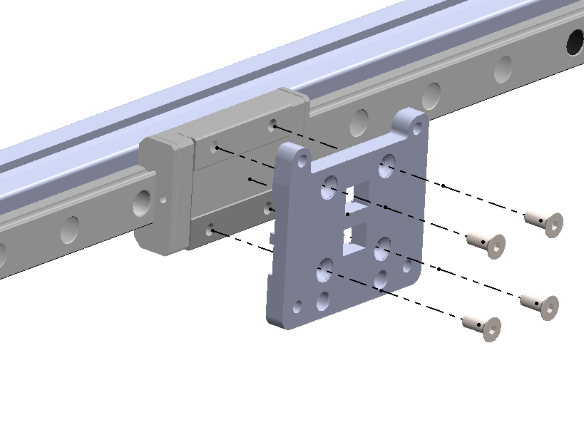
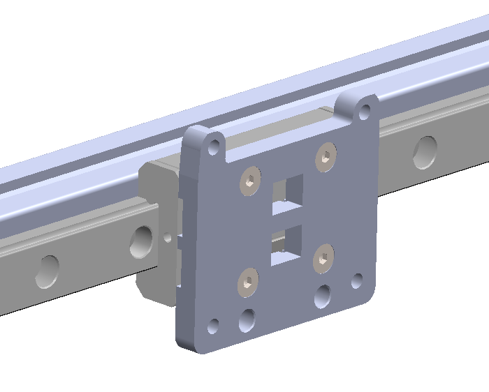
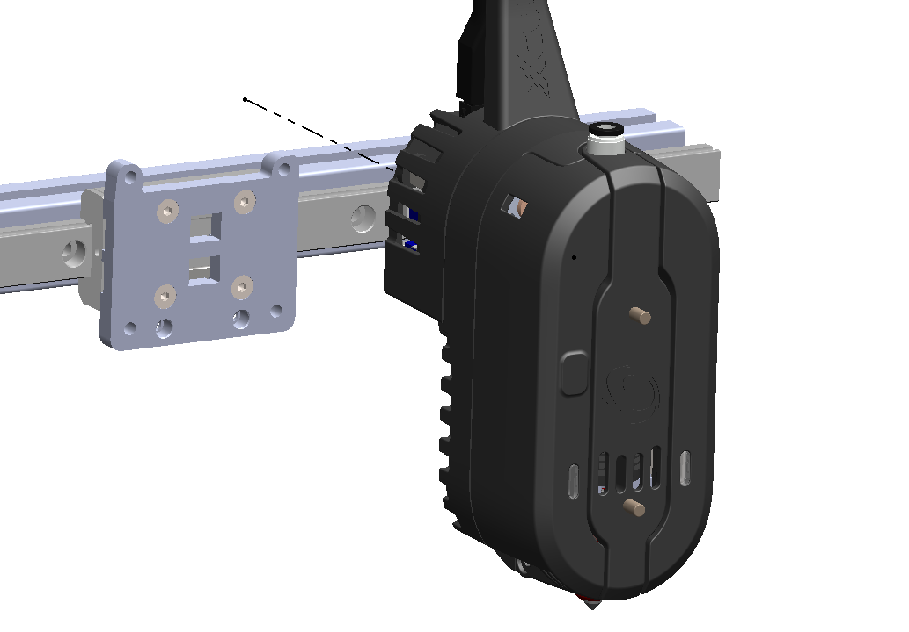
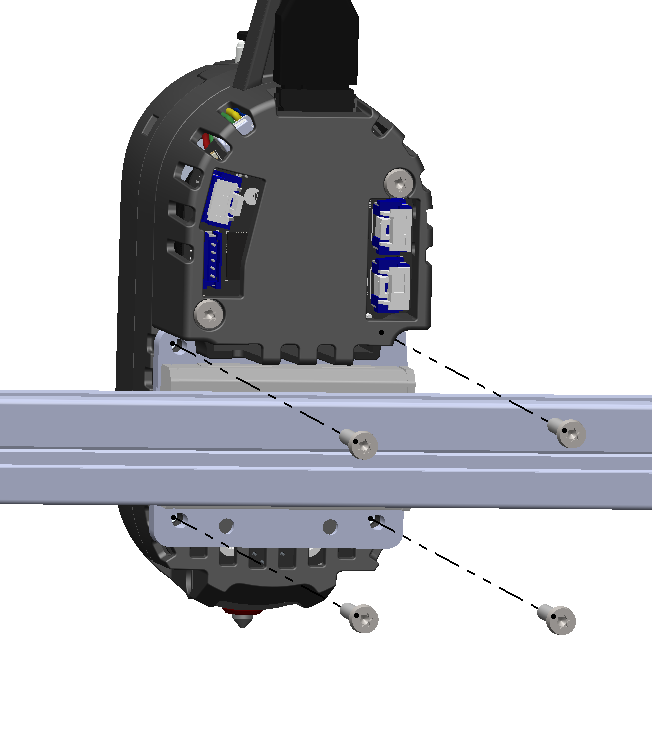
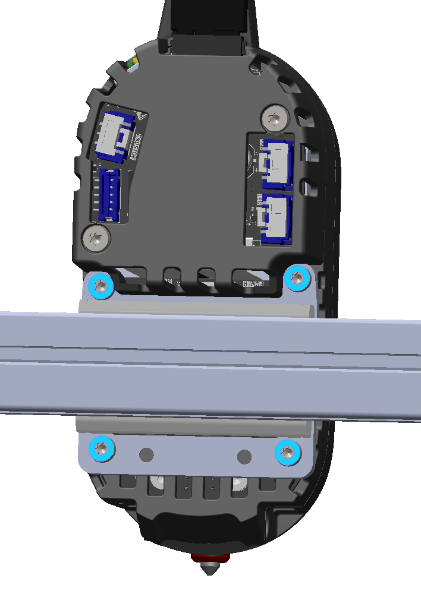
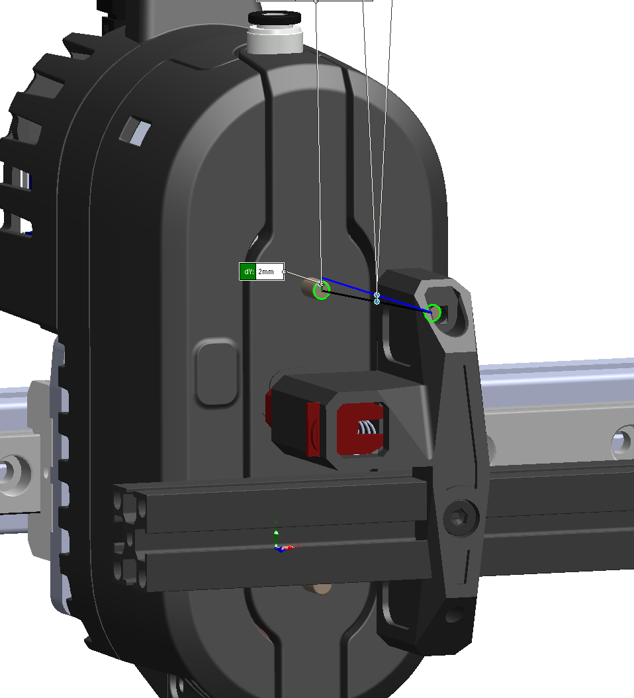
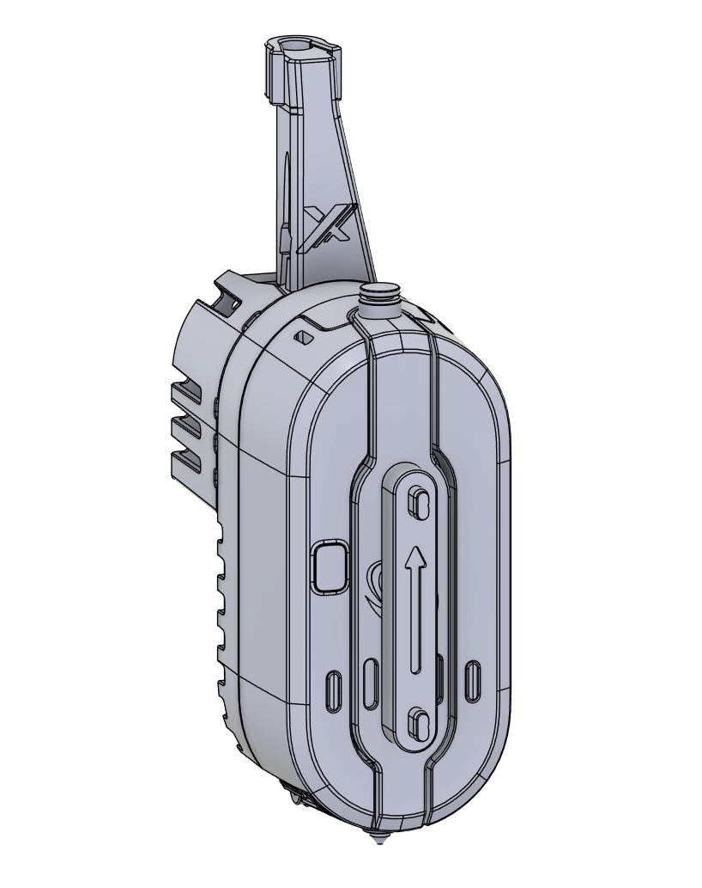
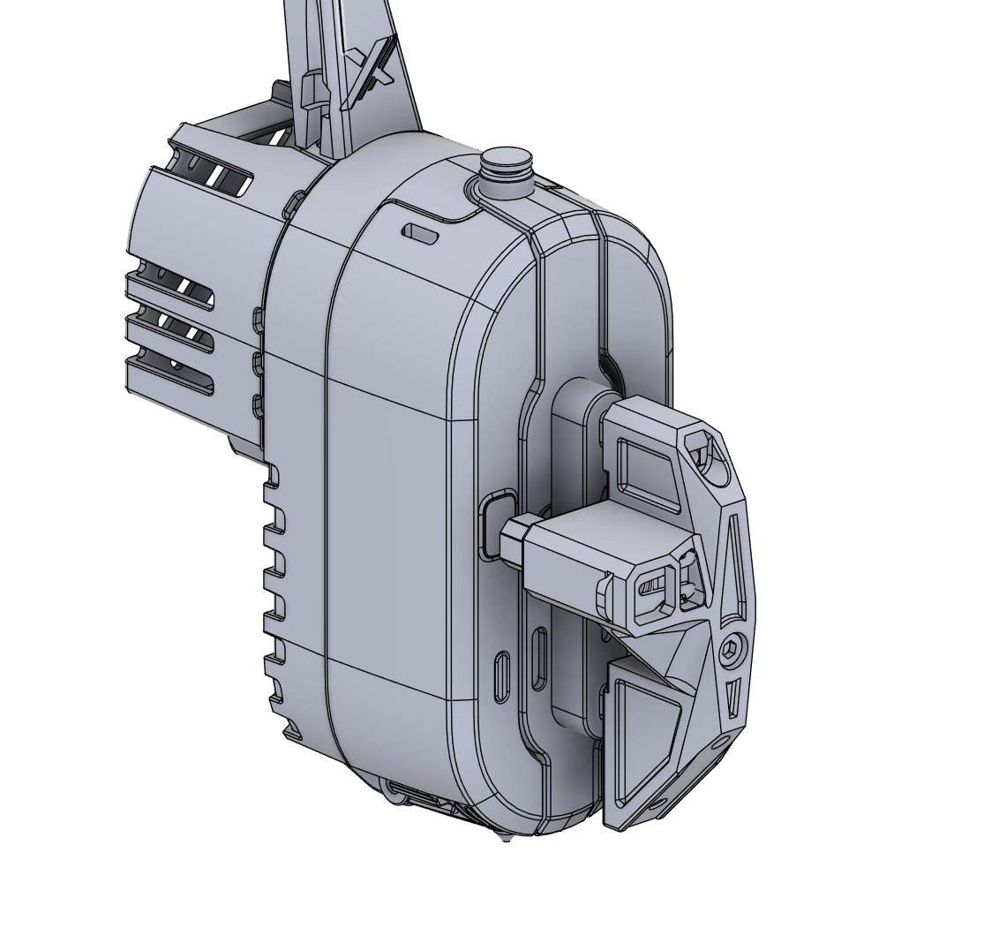
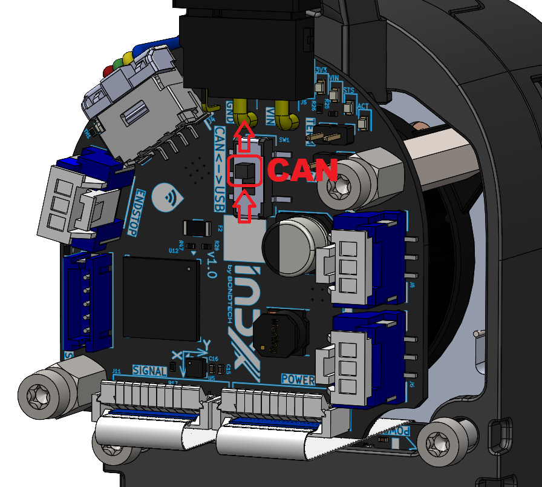
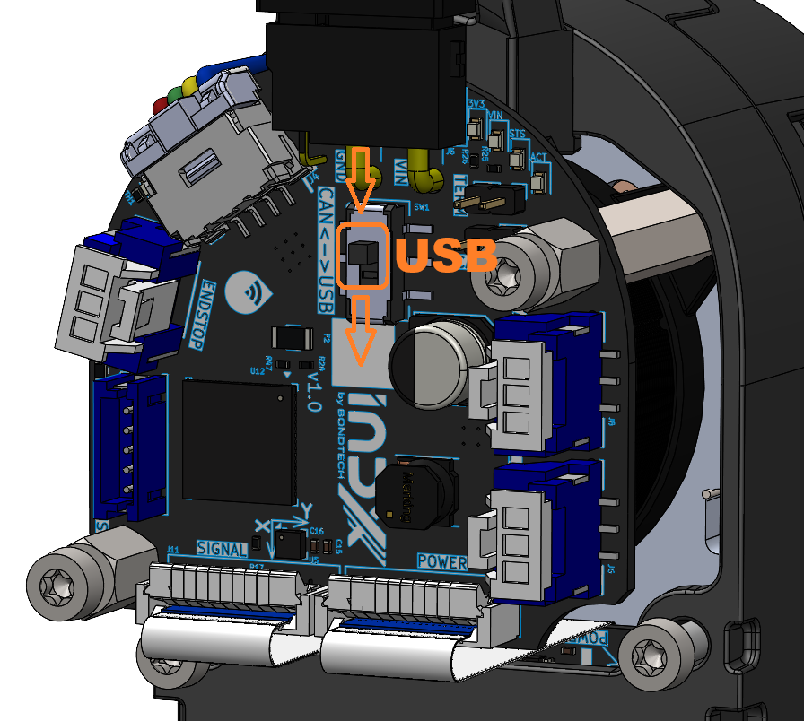

# INDX Wiki

> The community knowledge base for the Bondtech INDX, an induction-based automatic tool changer for open-platform XY-head 3D printers.

---

## Table of Contents

**Part 1: What is INDX?**

1. [What is INDX?](#what-is-indx)
2. [How It Works](#how-it-works)
3. [Kits & What's in the Box](#kits--whats-in-the-box)
4. [Supported Printers](#supported-printers)
5. [Technical Specifications](#technical-specifications)
   - [Part Cooling](#part-cooling)

**Part 2: Getting Started**

6. [Requirements & Preparation](#requirements--preparation)
7. [Installation](#installation)
   - [Hardware Installation](#hardware-installation)
   - [Firmware Configuration](#firmware-configuration)
     - [Klipper / Kalico](#klipper)
       - [INDX macro files](#indx-macro-files)
       - [Automated dock X measurement](#automated-dock-x-measurement-built-in)
       - [Homing override](#homing-order-important)
     - [RRF (RepRapFirmware)](#rrf-reprapfirmware)
   - [Initial Startup](#initial-startup)

**Part 3: Configuration**

8. [Configuration](#configuration)
   - [Dock Position Calibration](#dock-position-calibration)
     - [Finding dock_y](#finding-dock_y-y-fully-seated-position)
     - [Finding dock_x](#finding-dock_x-x-tool-centre)
   - [Tool Offsets](#tool-offsets)
     - [Method 1: Print and adjust](#method-1-print-and-adjust-free-no-extra-hardware)
     - [Method 2: Nudge](#method-2-nudge-automatic-requires-small-hardware)
     - [Method 3: Nozzle camera + CAL_01/02/03](#method-3-nozzle-camera-most-precise-xy-higher-cost)
     - [Z offset: CAL_Z](#z-offset-calibration)
   - [Temperature & Induction Settings](#temperature--induction-settings)
   - [Speed & Acceleration](#speed--acceleration)

**Part 4: Day-to-day Use**

9. [Using INDX](#using-indx)
   - [Loading Filament into Tools](#loading-filament-into-tools)
   - [Performing Tool Changes](#performing-tool-changes)
   - [Slicer Setup](#slicer-setup)

**Part 5: Designing for INDX**

10. [Designing for INDX](#designing-for-indx)
    - [Dock Design](#dock-design)
    - [Part Cooling (custom)](#part-cooling-1)
    - [CAD Files & Templates](#cad-files--templates)

**Part 6: Maintenance, Support & Community**

11. [Maintenance](#maintenance)
    - [Nozzle clog: cold pull procedure](#nozzle-clog-cold-pull-procedure)
12. [Troubleshooting](#troubleshooting)
13. [FAQ](#faq)
14. [Community & Contributing](#community--contributing)

---

**Part 1: What is INDX?**

---

## What is INDX?

INDX (INduction Dynamic eXtruder) is Bondtech's automatic tool-changer system for FDM 3D printers. It enables printing with multiple materials, colors, or nozzle sizes in a single print, with near-zero purge waste and tool changes in around 14 seconds. Run two tools or ten; scale your setup as far as your build space allows.

Unlike filament-switcher systems, INDX is a true tool changer: each tool carries its own filament directly. There is no shared filament path and no purge block required.

Unlike traditional mechanical tool changers, INDX uses wireless induction heating, so the passive tools contain **no wires, no heaters, no thermistors, and no electronics**. This makes each tool dramatically cheaper and mechanically simpler.

INDX is sold by Bondtech as a **Development Kit** for open CoreXY printers. Prusa Research has built an official first-party integration for the **CORE One** and **CORE One L**, sold directly through Prusa.

| | INDX Development Kit | Prusa CORE One / CORE One L |
|---|---|---|
| **Sold by** | Bondtech ([bondtech.se](https://www.bondtech.se)) | Prusa Research ([prusa3d.com](https://www.prusa3d.com)) |
| **For** | Most CoreXY printers with open firmware | Prusa CORE One / CORE One L |
| **Setup** | Self-managed (community-supported) | Plug-and-play |
| **Smart Head** | See [bondtech.se](https://www.bondtech.se) | See [prusa3d.com](https://www.prusa3d.com/applications/prusa-3d-printers-with-bondtech-indx_243519/) |
| **Passive Tools** | See [bondtech.se](https://www.bondtech.se) | See [prusa3d.com](https://www.prusa3d.com/applications/prusa-3d-printers-with-bondtech-indx_243519/) |

This wiki focuses on the **INDX Development Kit** and community integrations. For the Prusa integration, refer to [Prusa's documentation](https://www.prusa3d.com/applications/prusa-3d-printers-with-bondtech-indx_243519/).

---

## How It Works

INDX is built around two components: a single active **Smart Head** that stays on the gantry, and a set of interchangeable **Thin Passive Tools** parked in a dock.

### Smart Head

The single active unit that travels on the gantry. Contains all expensive and active components:

- **Induction coil (IN)**: wirelessly heats the nozzle of whichever passive tool is currently mounted on the Smart Head.
- **IR thermopile sensor**: reads nozzle temperature without physical contact. Also reports ambient temperature and nozzle surround temperature for monitoring.
- **Dynamic eXtruder (DX)**: self-adjusting dual-drive extruder with automatic tension mechanism.
- **Load cell**: used for sensing tool/nozzle touch.
- All wiring, electronics, and motion stays here; nothing transfers to the passive tools

### Thin Passive Tools

Interchangeable tools parked in a dock within reach of the gantry. Each tool contains a filament path and a specially designed nozzle, and nothing else. No wires, no heaters, no thermistors, no electronics. Heat is delivered wirelessly by the Smart Head's induction coil when the tool is picked up; the tool cools passively when deposited back in the dock.

Two variants are available, both built from hardened steel:

- **CHT (Core Heating Technology)**: splits filament into three strands internally for faster melting and higher flow rates. The standard choice for most materials including abrasive-filled filaments. Available in common sizes.
- **Standard (non-CHT)**: straight-through melt zone with lower back-pressure, optimized for soft flexible filaments (TPU, TPE).

Tools are held in the Smart Head by a high-precision **Maxwell coupling** (a 3-point kinematic coupling that self-aligns the tool to the exact same position every time it is picked up), ensuring micron-level repeatability on every tool change. In practice this means you calibrate your tool offsets once, and they stay correct across thousands of tool changes.

### Tool Change Sequence

1. Smart Head moves to the dock and deposits the current tool
2. Smart Head picks up the next tool
3. Induction coil heats the new nozzle to printing temperature (~4-10 seconds)
4. Printing resumes

**Total tool change time: ~14 seconds**, depending on temperature delta, priming, and travel distance.

Because every material runs in its own dedicated nozzle, there is no cross-contamination between materials; purging is not required. The only material used after a tool change is a small **prime** at the start of printing: when a nozzle heats up, the filament in the melt zone re-melts and pressure needs to be rebuilt before extrusion is consistent. Priming pushes a small amount of filament through to establish that pressure, ensuring the first line of print is correctly extruded. Because each tool also cools passively when separated from the Smart Head, oozing is minimal.

---

## Kits & What's in the Box

### Development Kit

The INDX Development Kit comes as a **base kit** (the core hardware you need to get started) plus **tools** and **accessories** you choose to match your printer and setup.

#### What's in the box

Every Development Kit includes:

| Component | Description |
| --------- | ----------- |
| **Bondtech INDX Smart Head** | The active unit: induction coil, contactless IR temperature sensor, DX extruder, and all electronics. One per printer. **Does not include a Thin Passive Tool**; tools are ordered separately. |
| **Bondtech INDX Link Board** | USB/CAN bridge between your host computer and the Smart Head. Includes 330 mm AWG18 power cables with horseshoe connectors for PSU screw terminals. A USB cable from the Link Board to your host is not included; see [Link Board](#link-board) for requirements. |
| **Crimp & connector kit** | Crimps and connectors for terminating accessories to the Bondtech INDX PCB: part cooling fan, LED, endstop, and USB devices. |

#### Tools

Thin Passive Tools are the interchangeable tool heads that do the actual printing. Choose quantity, nozzle type, and nozzle size when ordering. You need at least one tool to print, and one per material or color you want to run simultaneously.

| Option | Nozzle sizes | Best for |
| ------ | ------------ | -------- |
| **CHT (Core Heating Technology)** | 0.4 / 0.5 / 0.6 / 0.8 / 1.0mm | Most materials: PLA, PETG, ABS, ASA, PA, abrasive-filled filaments |
| **Standard (non-CHT)** | 0.25 / 0.4mm | Flexible filaments (TPU, TPE) and sensitive composites |

See [Thin Passive Tools](#thin-passive-tools) in the Technical Specifications for full details on each variant.

#### Accessories

Select the accessories that match your printer when ordering:

| Accessory | Options | Notes |
| --------- | ------- | ----- |
| **Bondtech INDX Link Cable** | Choose length | XT30 2+2 cable (24V, GND, CAN+, CAN−) with a shield connected to GND on the Link Board, from the Link Board to the Smart Head. Red/black wires carry power, yellow/white carry CAN H/L. Choose the length that fits your wiring run. See note below. |
| **Tool Dock** | Pre-made SLS hardware or STL/STEP files | Bondtech sells ready-made docks for common Makerbeam/1515 extrusion. Or download the files and print your own. |
| **X-Carriage adapter** | MGN12H option for 6mm belts, or download files | Required to mount the Smart Head to your carriage. Available for common CoreXY standards; check the shop or download from GitHub. |

> **What is CAN bus?** CAN bus is a communication standard that lets multiple devices share a single cable. You don't need to understand the protocol in depth; the Link Board handles it for you. In practice it means the Smart Head connects to the Link Board via just one 4-wire cable (carrying both power and data) instead of the bundle of wires a conventional toolhead needs. CAN is currently only supported on RRF; USB is used for Klipper/Kalico.
>
> **Choosing cable length:** Measure the wiring run from your Link Board mounting location to the Smart Head along the actual path the cable will travel (over the gantry, not straight-line). Add some slack. When in doubt, order longer. A cable that is too short cannot be extended, and excess length can be coiled and managed.

> **Integration note:** The Development Kit does not include a pre-configured printer profile or plug-and-play setup. You are responsible for integrating INDX with your printer's firmware and mechanics. The community provides configs and guides for common platforms; see [Supported Printers](#supported-printers) and [Community & Contributing](#community--contributing).

---

## Supported Printers

### First-party integrations

Prusa Research has built an official first-party integration for their CoreXY printers. These are sold and supported directly by Prusa, not through the INDX Development Kit.

| Printer | Status | Notes |
| ------- | ------ | ----- |
| Prusa CORE One | Available | Sold by Prusa Research. Plug-and-play. Supports up to 8 tools. See [prusa3d.com](https://www.prusa3d.com/applications/prusa-3d-printers-with-bondtech-indx_243519/) for details. |
| Prusa CORE One L | Coming later | First-party Prusa integration, availability timeline TBD. Supports up to 8 tools. |

### Officially supported integrations

Beyond the first-party Prusa integration, Bondtech officially supports a small set of community-built integrations for specific printers. Each comes with ready-to-print parts and the installation files needed to mount INDX on that machine. Download them from the links below.

| Printer | Designer | Files |
| ------- | -------- | ----- |
| Sovol SV08 OG & SV08 Max | 3DPrintDemon | [Printables](https://www.printables.com/model/1771164-official-indx-sovol-sv08-og-sv08-max-integrations) |
| Voron Trident R2 | Steve — Voron team, designer of the Trident | [Printables](https://www.printables.com/model/1761163-trident-r2-bondtech-indx-mods) |

### Community integrations

INDX runs on a wide range of CoreXY printers, far more than Bondtech could ever test and support directly. What makes that possible is community members who've done the integration work on their own printer and shared what they learned. Every config in the repo started with someone doing it for the first time.

> **What does "community" status mean?** The hardware works on that printer, but the integration guide comes from the community, not Bondtech. Some printers already have complete, verified configs on GitHub; check the repo first. Others are earlier stage. The [Bondtech Discord](https://discord.gg/XDX9jDXN6e) has channels for specific printers, which is a good place to find others running the same platform and see how far along the integration is.

| Printer | Status | Notes |
| ------- | ------ | ----- |
| Voron 2.4 | Community | |
| Voron Trident | Community | Trident R2 has an [officially supported integration](#officially-supported-integrations) |
| RatRig V-Core | Community | |
| Sovol | Community | SV08 OG / SV08 Max have an [officially supported integration](#officially-supported-integrations) |
| Custom CoreXY | Community | Any CoreXY with open firmware; see [Requirements](#requirements--preparation) |

**Your printer isn't listed?** If you've got INDX running on it, that integration belongs here. Submit a pull request on [github.com/BondtechAB/INDX](https://github.com/BondtechAB/INDX) and you'll save the next person hours of work. See [Contributing a printer integration](#contributing-a-printer-integration) for what to include.

---

## Technical Specifications

*Specifications are preliminary and subject to change.*

### Smart Head

| Specification | Value |
| ------------- | ----- |
| Maximum operating voltage | 24V |
| Maximum nozzle temperature | 300°C |
| Maximum ambient operating temperature | 60°C |
| Flow rate | 40mm³/s *(measured at 220°C with 25°C ambient; lower rates achievable depending on nozzle size)* |
| Nozzle heat-up time | ~4-8 seconds |
| Tool change time | ~14 seconds *(highly dependent on temperature, priming, and travel distance)* |
| Power consumption | ~60W |
| Tool change mechanism | Maxwell coupling (3-point kinematic) |
| Heater type | Induction coil |
| Temperature sensor | Wireless & contactless IR thermopile |
| Nozzle sensor | Load cell (bi-directional) |
| Extrusion system | Direct Drive |
| Filament pre-tension | Self-adjusting (DX extruder, dual-drive with automatic tensioning) |
| Extruder chassis material | Aluminium |
| Cowling material | SLS-printed PA12 |
| Minimum tool center-to-center distance | 34mm bare; **41mm** with Bondtech part cooling solutions |
| Weight | 345g *(including one tool)* |
| Dimensions | See [reference geometry](#cad-files--templates) |

### Part Cooling

INDX uses a modular part cooling system. Cooling solutions snap onto the outside of the Smart Head cowlings, making it easy to swap between setups without tools. Three options are supported:

| Option | Description |
| ------ | ----------- |
| **Dual 40×10 fans** | Two axial fans mounted symmetrically for balanced airflow around the nozzle |
| **CPAP** | High-flow airflow from a remote CPAP blower unit, routed via a flexible tube to the Smart Head, keeping weight off the gantry |

The right choice depends on your materials and print speed requirements. The dual 40×10 connect to the part cooling fan output on the Bondtech INDX PCB. The CPAP blower is a remote unit mounted elsewhere on the printer and connects to your main board instead; only the airflow tube routes to the Smart Head.

Printable ducts for both options are available in [CAD Files & Templates](#cad-files--templates).

### Bondtech INDX PCB

The Bondtech INDX PCB is mounted inside the Smart Head and is the central electronics board for the system.

**Electronics**

| Specification | Value |
| ------------- | ----- |
| Stepper driver | TMC2240 |
| Stepper run current | 0.6A |
| Extruder rotation distance | 5.7mm |
| Built-in accelerometer | LIS2DW |
| Built-in rotary encoder | AS5047D (magnetic) |
| Built-in load cell | *(specifications to be confirmed)* |

**Connectors**

| Connector | Pins | Notes |
| --------- | ---- | ----- |
| Motor | Coil A+, Coil A−, Coil B+, Coil B− | DX extruder stepper motor |
| Fan | TACHO, FAN+, GND | Supports tachometer feedback |
| LED | 5V (VBUS), NP OUT, GND | NeoPixel compatible |
| Endstop | 3V3, SIGNAL, GND | 3.3V logic level |
| USB | VBUS, DP+, DP−, GND, GND | Supports accessories such as camera or Beacon probe scanner |
| CAN termination jumper | — | Enable/disable CAN bus termination |
| CAN Reset jumper | — | Puts the board into DFU mode for firmware flashing; remove after flashing |
| Communication switch | CAN / USB | Selects between CAN-FD and USB communication modes; must match the switch position on the Link Board |

**Status LEDs**

| Label | Colour | Meaning |
| ----- | ------ | ------- |
| VIN | Blue | 24V power present |
| 3V3 | Green | 3.3V onboard regulator active |
| ACTIVITY | Green | CAN-FD bus activity (other than regular time-sync messages) |
| STATUS | Red | Flashes at ~1Hz in sync with the main board = CAN time sync OK; rapid continuous flashing = no CAN sync; startup error codes (see table below) |

On first boot or after a failed flash, the STATUS LED may flash a startup error code rather than the normal 1Hz pattern. The pattern is: slow blinks (group 1) pause, then fast blinks (group 2). If this happens, reflash the firmware.

**Startup error codes**

| Error | Slow blinks | Fast blinks | Description |
| ----- | ----------- | ----------- | ----------- |
| ErrorTempMin | 1 | 1 | Measured temperature too low |
| ErrorTempMax | 1 | 2 | Measured temperature too high |
| ErrorTempAmbientMin | 1 | 3 | Ambient temperature too low |
| ErrorTempAmbientMax | 1 | 4 | Ambient temperature too high |
| ErrorTempDiff | 1 | 5 | Requested temperature differs significantly from measured temperature |
| ErrorHeatMax | 2 | 1 | Heater on at max power for too long |
| ErrorHeatInput | 2 | 2 | Heater enable request active for too long |
| ErrorInternalTemp | 5 | 3 | IR sensor self-test failed at boot |
| ErrorInternalUart | 5 | 4 | Internal UART fault |
| ErrorInternalEnable | 5 | 5 | Internal enable fault |

**Front INDX LED states**

The Smart Head uses a NeoPixel-compatible LED array on the front face to communicate its current state during normal operation. These are the same LEDs that display startup error codes.

| State | Colour | Pattern |
| ----- | ------ | ------- |
| Heating | Amber (RGB 255, 191, 0) | Breathing at 0.5 Hz (sine); brightness starts at 0 and increases as temperature approaches target |
| Cold / at ambient | Green | Solid |
| At target temperature | Amber | Solid |
| Cooling down from hot | Blue | Solid |
| DFU (firmware update) mode | Blue | Blinking |
| Load cell transient (filament gripped) | Purple | Single fast flash (~200 ms), then returns to previous state; effect is suppressed while the stepper motor is energised |

**FFC cable warning**

The Smart Head contains two PCBs (INDX VF PCB and INDX MCU PCB) connected by 20-way FFC (Flexible Flat Cable) connectors. If you ever need to disconnect and reconnect them during servicing:

- Insert the cable straight; inserting at an angle is easy to do and will short pins. Powering up with a shorted FFC will likely damage the board.
- The latch direction on the INDX MCU PCB FFCs is counter-intuitive: the latch is **unlocked when up**. After inserting the cable, push the latch **down toward the PCB** to lock it.

### Link Board


The Link Board is a required component of every INDX Development Kit setup. It sits between your host computer and the Smart Head, acting as the USB/CAN bridge and providing several protection features that make the connection stable and safe.

**Why the Link Board is required**

The Link Board caps USB communication speed to **12 Mbps (Full Speed)**. While this is lower than the theoretical USB 2.0 maximum, it is intentional: Full Speed USB is dramatically more stable in electrically noisy printer environments than High Speed (480 Mbps). In practice this means fewer dropouts and disconnects, and a much more reliable connection to the Smart Head.

**Protection features**

| Feature | What it does |
| ------- | ------------ |
| **USB isolator** | Electrically isolates the Smart Head from your host computer. Any electrical fault or noise on the printer side cannot travel back through the USB cable to your Raspberry Pi or PC. |
| **Reverse polarity protection** | Prevents damage if the 24V power input is connected with reversed polarity. |
| **4A fuse** | Protects the power input. If something goes wrong on the 24V side, the fuse blows before damage can propagate further. |

**Communication switch**

The Link Board has a switch to select between **USB** and **CAN** communication modes. This must match the switch position on the INDX MCU PCB inside the Smart Head — both boards must be set to the same mode, or the connection will not work. See [Switch configuration](#3-wiring) for reference images showing the correct switch positions on the Smart Head side.

**USB cable (not included)**

A USB cable from the Link Board to your host computer is not included and must be sourced separately. Requirements:

- **Data cable, not a charge-only cable.** Charge-only cables omit the data lines entirely and will not work. Verify the cable is rated for data transfer before using it.
- **Correct impedance.** The cable must meet USB signal integrity requirements. Cheap or poorly made cables can cause dropouts even at Full Speed. Use a cable from a reputable brand.
- **Total USB run ≤ 2 meters.** The combined length of your USB cable (host to Link Board) and your INDX Link cable (Link Board to Smart Head) must not exceed 2 meters. Plan your cable routing and Link cable length selection with this in mind.

**Specifications**

| Specification | Value |
| ------------- | ----- |
| Host connection | USB-C |
| Printer-side connection | Link cable to Bondtech INDX PCB |
| Input power | 24V + GND from PSU |
| Included power cables | AWG18, 330mm, horseshoe connectors for PSU screw terminals |
| USB speed | 12 Mbps (Full Speed) |
| Fuse rating | 4A |
| Max total USB run | 2 meters (USB cable + Link cable combined) |

### Thin Passive Tools

All Thin Passive Tools are built from hardened steel, contain no electronics or wiring, and use induction heating via the Smart Head. Two variants are available:

**CHT (Core Heating Technology): Standard choice for most materials**

Uses Bondtech's patented CHT internal geometry, which splits filament into three thinner strands for faster melting and higher flow rates. Recommended for PLA, PETG, ABS, ASA, PA, and abrasive-filled filaments (Carbon Fiber, Glass Fiber). Not recommended for soft flexible filaments.

| Specification | Value |
| ------------- | ----- |
| Available nozzle sizes | 0.4 / 0.5 / 0.6 / 0.8 / 1.0mm |
| Material | Hardened steel |
| Compatible filament diameter | 1.75mm |
| Maximum nozzle temperature | 300°C |
| Electronics | None |
| Weight | 25g |

**Standard (non-CHT): For flexible and sensitive materials**

Uses a straight-through melt zone with minimal back-pressure, specifically optimized for soft flexible filaments (TPU, TPE) and sensitive composites. Built to the same hardened steel standard, so it handles abrasive filaments equally well.

| Specification | Value |
| ------------- | ----- |
| Available nozzle sizes | 0.25 / 0.4mm |
| Material | Hardened steel |
| Compatible filament diameter | 1.75mm |
| Maximum nozzle temperature | 300°C |
| Electronics | None |
| Weight | 25g |

---

**Part 2: Getting Started**

---

## Requirements & Preparation

If you've built a Voron or a similar CoreXY printer from scratch, you have the skills needed to install INDX. The process involves editing Klipper config files, SSH access to your host computer, and careful mechanical alignment. Nothing beyond what a first-time Voron builder will have already done.

### Printer Requirements

For the Development Kit, your printer must meet these minimum requirements:

- **Motion system:** CoreXY, H-bot, Markforged, Cartesian XY-head, or similar. Supported: any motion system where the toolhead moves in XY and Z is handled by the bed or gantry — i.e. CoreXY (not cross-gantry), H-bot, Markforged, and independent-axis Cartesian (XY-head, e.g. Ender 5). Not supported: bed-slinger Cartesian (XZ-head), where the bed moves in Y, or Positron-style machines.
- **Firmware:** Kalico (recommended — native INDX support built in), Klipper, or RepRap Firmware (RRF)
- **Gantry clearance:** 50mm X, 44mm Y. Total toolhead height is ~152mm including strain relief. Additional clearance is required for umbilical and filament management.
- **Dock mounting area:** Each dock is ~70mm tall, 28.5mm wide (X), and 25mm deep (Y). Minimum tool center-to-center spacing is 34mm bare, or 41mm when using the Bondtech part cooling solutions.
- **Wiring:** 24V from the PSU to the Link Board (AWG18 horseshoe-connector cables included). Host computer to Link Board via USB-C or CAN. Link Board to Smart Head via INDX Link Cable (XT30 2+2, carries 24V, GND, CAN+/−, and shield).
- **Print volume impact:** Depends on printer geometry. Printers with sufficient Y overtravel may lose nothing. With a well-designed integration the worst case is 28.5mm of Y travel; avoid designs that exceed this.

### Electrical Requirements

INDX uses two boards: the **Bondtech INDX PCB** (inside the Smart Head) and the **INDX Link Board**.

**Bondtech INDX PCB**

The Bondtech INDX PCB is the central electronics board inside the Smart Head. It consists of two parts connected internally:

- **INDX VF PCB**: handles induction heating, contactless IR temperature sensing, and the heatsink fan
- **INDX MCU PCB**: handles all processing and communication: extruder motor control, accelerometer, load cell, CAN-FD communication, and the external connectors

All electronics are pre-installed inside the Smart Head; no internal wiring required. The Smart Head connects to the Link Board via a single INDX Link Cable (24V, GND, CAN H/DP+, CAN L/DN−, shield to GND) and exposes the following connectors:

- **Motor**: 4-pin, drives the DX extruder (TMC2240 driver). Pin 1 Coil A+, Pin 2 Coil A−, Pin 3 Coil B+, Pin 4 Coil B−
- **Endstop**: 3-pin, 3.3V logic level. Pin 1 3V3, Pin 2 SIGNAL, Pin 3 GND
- **Fan**: 3-pin, supports tachometer feedback. Pin 1 TACHO, Pin 2 FAN+ (PWM 24V), Pin 3 GND
- **LED**: 3-pin NeoPixel. Pin 1 5V (VBUS), Pin 2 NP OUT, Pin 3 GND
- **USB**: 5-pin, supports accessories such as a camera or Beacon probe scanner. Pin 1 VBUS (5V), Pin 2 DP+, Pin 3 DP−, Pin 4 GND, Pin 5 GND
- **Built-in accelerometer**: for resonance measurement and automatic input shaper calibration in Klipper
- **CAN termination jumper**: fitting the jumper enables the 120 Ω end-of-line termination resistor. Fit only on boards at the physical ends of the CAN bus.
- **CAN reset jumper**: Klipper: short the jumper to enter DFU mode for flashing. RRF: fit the jumper for CAN reset (also resets the CAN address). See the [Duet INDX Toolboard documentation](https://docs.duet3d.com/en/Duet3D_hardware/Duet_3_family/INDX_Toolboard).
- **Status LEDs**: 3V3, VIN, STATUS, ACTIVITY

Induction heating and contactless IR temperature sensing are handled internally by the INDX VF PCB; no additional wiring or configuration needed.


**Klipper pin → port mapping** (not exposed in RRF)

| Function | Port(s) |
| -------- | ------- |
| Motor | STEP `PB12` · DIR `PB23` · ENN `PB4` · CS `PA10` · SPI1 SCLK `PA5` / MOSI `PA4` / MISO `PA7` |
| Endstop | `PA9` |
| Part cooling fan | FAN `PA1` · TACHO `PA0` |
| Heatsink fan | FAN0 `PA21` · TACHO `PA20` |
| Neopixel | `PA8` |
| Eddy scanner | ldc_int `PB10` · ldc_clk `PB11` · temp_ldc `PB9` |

**Link Board**

The Link Board is required and bridges your host computer to the Smart Head. For full details on protection features, the communication switch, and USB cable requirements, see [Link Board](#link-board) in the Technical Specifications.

For wiring purposes:

- Requires **24V and GND** from your printer's power supply; connect using the included power cables (AWG18, 330 mm, pre-terminated with horseshoe connectors for screw terminal PSUs)
- Connects to the Smart Head via the INDX Link Cable
- Connects to your host computer via USB (cable not included — see [Link Board](#link-board) for requirements)
- The communication switch on the Link Board must match the switch on the INDX MCU PCB; both must be set to the same mode

**Power**

- The system runs on **24V**
- The Link Board is powered by a direct 24V/GND connection from your PSU
- Power is then passed through the Link cable (24V, GND, CAN+/D+, CAN−/D-) from the Link Board to the Smart Head; no additional PSU connection needed at the Smart Head

**Mainboard compatibility**

- Works with any printer running a Raspberry Pi, similar host computer or Duet board
- The Link Board connects to the host via CAN/USB; the host handles CAN/USB communication to the Bondtech INDX PCB

### Software Requirements

- **Kalico (recommended):** native INDX support is built in — nothing to install on the host, and the MCU firmware ships with Kalico. See [Firmware Configuration](#klipper).
- **Klipper (mainline):** add the [`indx_klipper`](https://github.com/BondtechAB/indx_klipper) module (installed with its `install.sh`), which brings the same INDX support to a stock Klipper install. See [Firmware Configuration](#klipper).
- RRF: RepRapFirmware **3.7.0-alpha (2026-02-10) or later**, required on both the main board and the Bondtech INDX PCB.
- Slicer: Any slicer with multi-filament or multi-color support

### Tools Required

| Tool | Use |
| ---- | --- |
| Hex keys | Smart Head, X-carriage adapter, and dock mounting |
| Crimping tool | Optional; only needed if connecting accessories (fan, LED, endstop, or USB devices) to the Bondtech INDX PCB |

### Skills Assumed

- Editing Klipper config files (`.cfg` syntax, adding sections, restarting Klipper)
- SSH access to your host computer (the [Connect via SSH](#connect-to-your-printer-via-ssh) section covers this if you need a refresher)
- Crimping JST and similar connectors

### What to Have Ready Before Starting

- A working printer, homed, printing, and confirmed stable before you begin
- Kalico (or Klipper / RRF) installed and running on your host computer
- SSH access to your host computer confirmed
- Spool holders and filament routing planned for the number of tools you intend to run

---

## Installation

> **Note:** These are general installation guidelines using the Bondtech-sold hardware as an example. Because INDX works across many different CoreXY printers, exact details (screw sizes, adapter geometry, carriage type, dock placement) will vary by printer. For printer-specific integration guides, check the [github.com/BondtechAB/INDX](https://github.com/BondtechAB/INDX) repository and the community resources in [Community & Contributing](#community--contributing).

### Hardware Installation

#### 1. Install the Smart Head

The Smart Head replaces your printer's existing toolhead entirely. It mounts to the X-axis carriage using a two-part system:

1. **X-carriage adapter**: bolts onto your carriage
2. **Smart Head**: attaches to the X-carriage adapter with 4 bolts

**X-carriage adapters** are available in two ways:


| Source             | Material                | Notes                                                                                                                      |
| ------------------ | ----------------------- | -------------------------------------------------------------------------------------------------------------------------- |
| Bondtech (shop)    | SLS-printed Nylon 12 GF | Common MGN12 carriage options available to purchase                                                                    |
| GitHub / community | User-printed            | STL/STEP files on [github.com/BondtechAB/INDX](https://github.com/BondtechAB/INDX); print your own for less common setups |


If your carriage configuration isn't covered by Bondtech's sold options, check the GitHub repo for a community-contributed adapter or print your own from the provided files. A printable MGN12H adapter (6mm belts) is available in [CAD Files & Templates](#cad-files--templates). Community-made X-carriage designs that meet quality standards will be included in the official repo. If you're designing your own, see [CAD Files & Templates](#cad-files--templates) for the reference geometry files.

> **Before you start:** Remove your existing hotend, part cooling fan, and any toolhead PCB or wiring mounted on the carriage. The Smart Head replaces all of this.

**Step 1: Mount the X-carriage adapter to the carriage**

Route and attach the belts behind the X-carriage, then attach the X-carriage adapter to your carriage block using the screws specified for your adapter. Tighten firmly but do not overtighten.





**Step 2: Place the Smart Head onto the adapter**

Slide the Smart Head onto the X-carriage adapter so the mounting faces are flush.



**Step 3: Secure the Smart Head**

Fasten the Smart Head to the adapter using 4 screws as specified for your adapter. Tighten firmly but do not overtighten.





The Smart Head is now installed on the carriage.

**Attach part cooling**

Part cooling solutions snap onto the outside of the Smart Head cowlings. Attach your chosen cooling solution now before mounting the dock.

**Installing the fan shroud clip**

1. Loosen the screw that holds the INDX Front Cover.

   

2. Use an M3×8 screw to secure the INDX Front Cover together with the fan shroud clip.

   

3. With the clip installed, attach the fan shroud to the Front Cover. The shroud has an upper tab that locates into a slot at the top of the Front Cover (highlighted in blue). Align the tab with the slot, then rotate the bottom of the shroud inward until it seats in position.

   

#### 2. Mount the Dock

The dock can be positioned anywhere within the gantry's travel range, but the Smart Head must be able to face the docked tools directly to pick them up. The right location depends on your printer's layout.

**Frame requirement**

The dock must be mounted to a rigid bar or frame element; the dock hardware alone cannot be free-standing. Most CoreXY printers have an extrusion or crossbar that works for this. If your printer does not have a suitable mounting point, you will need to add one before proceeding.

The Bondtech-sold dock hardware is designed to mount on **15×15 aluminium extrusion**. If you are printing your own dock from the GitHub files, design your mounting to suit your frame.

> ⚠️ **Critical:** The dock has strict positioning requirements that must be met for reliable tool changes. Incorrect placement will cause failed pickups. See the critical requirements below before mounting.

**Dock options:**


| Source          | Type                                 | Mounting                                     |
| --------------- | ------------------------------------ | -------------------------------------------- |
| Bondtech (shop) | SLS-printed Nylon 12 GF              | Common options for 15×15 aluminium extrusion |
| GitHub          | Reference design + community designs | Print yourself, or adapt for your frame      |


Community-contributed dock designs will be added to [github.com/BondtechAB/INDX](https://github.com/BondtechAB/INDX) as they are developed. If you design a dock for an unlisted printer or frame, consider submitting it. See [Dock Design](#dock-design) for geometry constraints and design requirements before you start.

**Critical dock positioning requirements**

**Height**

The dock must be positioned so that a parked tool sits **2mm higher** than it does when held in the Smart Head. This offset is what allows the Smart Head to pick up and deposit tools cleanly.



**Alignment method**

Use the printable alignment jig ([`INDX_Dock_calibration_tool.stl`](CAD/STL/INDX_Dock_calibration_tool.stl)) placed over the nozzle tool in the toolhead to set the correct height. The printer does not need to be powered on for this step; you are setting the physical dock height manually.

1. Place the printed alignment jig over the tool magnets while the tool is in the smart head.

   

2. Loosen the bar holding screws in order to let it be adjusted up and down, then slide the smart head toward the tool dock and make sure the alignment jig enters the magnet holes smoothly without the smart head nodding from mechanical strain.

   

3. Secure the dock bar at that height

#### 3. Wiring

Wiring up the Smart Head is unusually simple for a toolhead. On a conventional setup, you're running individual wires for the heater cartridge, thermistor, hotend fan, stepper motor, and any probes or sensors, each terminated, routed, and managed separately. With INDX, all of that is internal: the induction coil, IR temperature sensor, and heatsink fan are all handled inside the Smart Head with no external connections required. The only cable you run to the Smart Head is a single INDX Link Cable, four wires carrying 24V power and data.

The included **Link Board** acts as the bridge between your host computer and the Smart Head. Your host computer connects to the Link Board via USB (cable not included — see [Link Board](#link-board) for requirements), the Link Board connects to the Smart Head via the INDX Link Cable, and the Link Board receives 24V power from the PSU via the included AWG18 cables. That's the entire wiring run.

**Overview of connections:**

```
24V PSU ──────────────────────────────────────────────┐
                                                       │ 24V + GND
Raspberry Pi / host computer                           ▼
    │                                             Link Board
    └── USB ──────────────────────────────────────────►│
                                                       │
                                                       └── Link cable (24V, GND, CAN H/DP+, CAN L/DN−) ──► Bondtech INDX PCB (inside Smart Head)
                                                                                                           │
                                                                                                           ├── Motor (Coil A+, Coil A−, Coil B+, Coil B−)
                                                                                                           ├── Fan (TACHO, FAN+, GND)
                                                                                                           ├── LED (5V, NP OUT, GND)
                                                                                                           ├── Endstop (3V3, SIGNAL, GND)
                                                                                                           └── USB (VBUS, DP+, DP−, GND, GND)
```

**Switch configuration**

Before connecting the Link cable, set the communication mode switches on **both boards** to match: the switch on the INDX MCU PCB inside the Smart Head, and the switch on the Link Board. Both must be set to the same mode or the connection will not work.

Set both switches to **CAN** if you are using RRF. Set both to **USB** if you are using Klipper or Kalico.


*Switch set to CAN mode*


*Switch set to USB mode*

#### 4. Flash the Bondtech INDX PCB

The Bondtech INDX PCB needs to be flashed with the correct firmware before the Smart Head can communicate with your printer. The flashing process differs depending on your firmware; follow the section for your setup.

##### Klipper / Kalico

Flashing is done over SSH from your computer into the Raspberry Pi (or other host computer) running Kalico or Klipper.

**What you need**

- **PuTTY**: a free SSH client for Windows. Download it from [putty.org](https://www.putty.org/).
- Your printer's **IP address**: find this in your router's device list, or check the display on your host if it shows one. You can also use the hostname (e.g. `mainsailos.local` or `fluidd.local`) if your network supports it.

###### Connect to your printer via SSH

1. Open PuTTY
2. Enter your printer's IP address (or hostname) in the **Host Name** field
3. Make sure **Port** is set to `22` and **Connection type** is `SSH`
4. Click **Open**
5. Log in with your printer host credentials; the default username for most Klipper distributions is `pi` (Mainsail OS / FluiddPI) with the password you set during setup

You should now have a terminal prompt on your printer's host computer.

**Enter the bootloader**

Flashing happens while the Bondtech INDX PCB is in bootloader mode. If the board already has firmware, put it into the bootloader by fitting the **CAN RESET jumper** on the INDX MCU PCB while powering the board up. In bootloader mode the board enumerates on the host as a Microchip USB device (vendor `04d8`, product `e483`), identified as **"INDX Toolboard Bootloader"** by Bondtech AB. Confirm it is present with:

```bash
lsusb | grep 04d8:e483
```

**Kalico (recommended)**

Kalico ships with native INDX support built in — both the host module and the MCU firmware are part of the Kalico source tree, so there is nothing extra to install. Build and flash from your Kalico directory (usually `~/klipper`):

```bash
cd ~/klipper
KCONFIG_CONFIG=board_configs/bondtech_indx_usb.config make
KCONFIG_CONFIG=board_configs/bondtech_indx_usb.config make flash FLASH_DEVICE=04d8:e483
```

The `board_configs/bondtech_indx_usb.config` build config is included with Kalico. It preselects the SAME51 MCU, USB communication, and the INDX heater feature, so you don't need to run `make menuconfig`.

**Klipper (mainline)**

Mainline Klipper does not include INDX support. Add it with the `indx_klipper` module, then build and flash:

```bash
git clone https://github.com/BondtechAB/indx_klipper.git
cd indx_klipper
./install.sh /home/pi/klipper        # adjust the path to your Klipper install
make
make flash FLASH_DEVICE=04d8:e483
```

Once flashing is complete, remove the CAN RESET jumper (if you fitted one), power-cycle the Smart Head, and proceed to firmware configuration.

##### RRF (RepRapFirmware)

For RRF, flash and configure the Bondtech INDX PCB following the [Duet INDX Toolboard documentation](https://docs.duet3d.com/en/Duet3D_hardware/Duet_3_family/INDX_Toolboard).

#### 5. Load Passive Tools into the Dock

**Verify the Tool Dock Activator**

Before loading tools, check that the Tool Dock Activator is correctly installed. It is a small bracket mounted upright on the 15×15 mm aluminium extrusion using an M3×10 screw and an M3 nut. It must be perfectly vertical; this is the component that triggers the INDX latch mechanism during pickup.


Check that it is perpendicular to the extrusion:


**Load tools into the dock**

One passive tool fits in one dock position. Tools are retained by 3×8 mm bar magnets embedded in both the tool and the dock. The magnets naturally guide the tool into the correct orientation as you bring it close; follow the magnetic pull to seat it.


> **Note:** You will set the exact dock position coordinates (`dock_y` and `t*_x`) during the calibration steps later. For now, just seat the tools; the INDX macros handle the rest once configured.

---

### Firmware Configuration

#### Klipper

INDX's host-side support provides everything your printer needs to talk to the Smart Head: the `indx` temperature sensor, induction-heater control, extruder and accessory pin mapping, and the calibration commands. How you add it depends on your firmware:

- **Kalico (recommended):** support is **built in**. There is nothing to install on the host — the `[indx]` object and the `indx` sensor type are part of Kalico, and the MCU firmware ships with it too. Once you've flashed the Bondtech INDX PCB from the Kalico tree (see [Flash the Bondtech INDX PCB](#4-flash-the-bondtech-indx-pcb)), go straight to configuring your printer.
- **Klipper (mainline):** install the [`indx_klipper`](https://github.com/BondtechAB/indx_klipper) module, which adds the same host-side support to a stock Klipper install. Clone it and run its `install.sh` (see [Flash the Bondtech INDX PCB](#4-flash-the-bondtech-indx-pcb) for the commands).

The tool-change and calibration **macros** (`T0`/`T1`…, `PARK_TOOL`, the `CAL_*` helpers) are provided by the INDX macro package — see [INDX macro files](#indx-macro-files).

**Configure your printer**

After installing the plugin, add your INDX configuration to `printer.cfg`:

Add the following to your `printer.cfg`. The `serial` path under `[mcu indxmcu]` will be unique to your board; see the note below on how to find it.

```ini
[mcu indxmcu]
# Replace the serial path below with the one from your board — see "Finding your serial path" below
serial: /dev/serial/by-id/usb-Bondtech_INDX_<your-serial-here>

[indx]
mcu: indxmcu

# These are control parameters for the induction heater — leave them at these values
pid_kp: 1.0
pid_ti: 0.0
pid_td: 0.0
pid_b: 1.0

[extruder]
sensor_type: indx  # Custom sensor type provided by the INDX plugin — reads temperature via the IR sensor on the induction board
min_temp: 0
max_temp: 350

heater_pin: indx:heater
# Induction heating uses watermark (on/off bang-bang) control, not PID.
# This works well for induction because of its very fast response time. Do not change to pid.
control: watermark
nozzle_diameter: 0.4     # Change to match your passive tool nozzle size (0.4 / 0.6 / 0.8 / 1.0)
filament_diameter: 1.75

step_pin: indxmcu:motor_step
dir_pin: indxmcu:motor_dir  # If filament feeds backwards, change to: !indxmcu:motor_dir
enable_pin: !indxmcu:motor_enable
microsteps: 32
rotation_distance: 5.7  # Pre-calibrated for the DX extruder — do not change

[tmc2240 extruder]
cs_pin: indxmcu:motor_cs
spi_software_sclk_pin: indxmcu:motor_sclk
spi_software_mosi_pin: indxmcu:motor_mosi
spi_software_miso_pin: indxmcu:motor_miso
rref: 24000  # Reference resistor value for the TMC2240 on the INDX PCB — do not change
run_current: 0.6

[fan]
pin: indxmcu:part_cooling
tachometer_pin: indxmcu:part_cooling_tacho

[neopixel indx]
pin: indxmcu:led
chain_count: 16  # Fixed for the Smart Head LED array — do not change

[gcode_button endstop]
pin: ^indxmcu:endstop
press_gcode: {action_respond_info("press")}
release_gcode: {action_respond_info("release")}

[lis2dw]
# Built-in accelerometer on the INDX PCB — used for input shaper calibration
i2c_mcu: indxmcu
i2c_bus: sercom3

[angle indx]
# Magnetic encoder that reads extruder rotation — used for precise extrusion monitoring
sensor_type: as5047d
stepper: extruder
cs_pin: indxmcu:encoder_cs
spi_bus: sercom1
```

> ⚠️ **Do not change `rotation_distance`**
>
> The `rotation_distance: 5.7` value is pre-calibrated for the DX extruder and is used by the INDX tool-change macros to calculate precise filament moves during tool changes. Changing it, even slightly, will cause incorrect filament positioning and failed tool changes. Do not treat it as a value to tune. If your extrusion multiplier needs adjusting, do it in the slicer, not here.

**Finding your serial path**

The `serial` value under `[mcu indxmcu]` is unique to your board. To find it, SSH into your printer (see [Connect to your printer via SSH](#connect-to-your-printer-via-ssh)) and run:

```bash
ls /dev/serial/by-id/
```

Copy the path that starts with `usb-Bondtech_INDX` and paste it into your config.

**Configuring multiple tools**

The `[extruder]` block above is always required and represents the Smart Head's single DX extruder. INDX passive tools are **not** separate Klipper extruders — there is only ever one `[extruder]`. Additional tools (T1, T2, …) are defined in `indx.cfg`: set `variable_tool_count` and add a `variable_t{n}_x` / `variable_t{n}_dock_y` pair per tool in the `[gcode_macro TOOL_POSITIONS]` section (see [INDX macro files](#indx-macro-files)). Per-tool XY/Z offsets come from [Tool Offsets](#tool-offsets) calibration, and per-tool nozzle sizes and temperatures are set in your slicer.

##### INDX macro files

The INDX firmware plugin provides a set of `.cfg` files you include from `printer.cfg`. Each file has a specific role:

| File | Role |
| ---- | ---- |
| `indx.cfg` | User configuration: tool positions and related settings. **The only file you need to edit.** |
| `indx-tc-macros.cfg` | Tool change logic: `CHANGE_TOOL`, `PARK_TOOL`, boot detection. Do not edit. |
| `indx-cal.cfg` | Calibration macros: dock position, XY/Z offset calibration. |
| `homing.cfg` | `[homing_override]`: Y then X, ensure a tool (T0 when possible), then Z. |

Include them from your `printer.cfg`:

```ini
[include indx/indx.cfg]
[include indx/indx-tc-macros.cfg]
[include indx/indx-cal.cfg]
[include indx/homing.cfg]
```

Klipper allows only one `[homing_override]`. If your printer already has one (sensorless current, bed raiser, etc.), merge the INDX sequence into yours instead of including `homing.cfg` as-is.

##### Automated dock X measurement (built in)

Automated dock X measurement is **built into the INDX plugin** — there is no separate Python extra to install. The plugin registers `INDX_DOCK_MEASURE`, which energises the XY motors, homes Y then X from the dock, and derives the absolute dock position from the raw stepper counts (so it works for each tool in turn without a prior `G28`).

The `indx-cal.cfg` macros wrap this into the calibration commands you actually run:

| Command | Description |
| ------- | ----------- |
| `CALIBRATE_DOCK_X TOOL=N` | Measures dock X for tool N via `INDX_DOCK_MEASURE` and reports the value to paste into `indx.cfg`; see [Dock Position Calibration](#dock-position-calibration) |
| `READ_DOCK_POSITION TOOL=N` | Reports the current (already-homed) X as dock X for tool N |

---

##### Homing order (important)

With a dock mounted on your printer, the default homing sequence can cause crashes. The Smart Head must move away from the dock before X is homed, and if a tool other than T0 is currently mounted it must be parked before Z is homed.

The INDX macro package includes a ready-to-use `[homing_override]` in `homing.cfg` that handles all of this. Its sequence, in full:

1. If Z is already known: raise to `probe_z_clearance` (set in `indx.cfg`)
2. Home Y, then move to `clearance_y` so X does not sweep into the dock
3. Home X
4. Before Z: require a seated tool (`VERIFY_TOOL_PRESENT`). If Z is known and the head is empty or not on T0, park/pick T0 via the dock. If Z has never been homed, dock pickup is unsafe - seat and lock a tool by hand after load-cell calibration, then home. Empty-head Z is refused (the load cell will not trigger without a nozzle).
5. Move to the probe XY (`probe_x` / `probe_y`, or bed centre) and home Z

T0 is the reference tool for Z when the dock is usable. That keeps other tools' Z offsets consistent.

If you use sensorless XY homing, wrap the `G28 Y` / `G28 X` steps in your usual TMC current reduce/restore (merge into the override if you already have one).

**Review your `PRINT_START` macro**

If you are migrating from a single-toolhead printer, your existing `PRINT_START` macro almost certainly heats the hotend before printing starts, something like `M104 S{first_layer_temperature}` or `M109 S{first_layer_temperature}`. With INDX, this will cause problems: there is no hotend to heat until a tool has been picked up by the Smart Head.

> ⚠️ Any hotend heating commands in your `PRINT_START` macro must come **after** the first tool pick-up (`T0`). Sending a heat command before a tool is picked up will result in an error, and depending on your macro structure, may cause a crash or leave the printer in a bad state.

Review your `PRINT_START` macro and move all `M104`/`M109` (and any temperature wait commands) to after the first `T0` call. If you are writing a fresh macro, pick up a tool first, then heat.

#### RRF (RepRapFirmware)

Configure the Bondtech INDX PCB in RRF following the [Duet INDX Toolboard documentation](https://docs.duet3d.com/en/Duet3D_hardware/Duet_3_family/INDX_Toolboard).

### Initial Startup

Before calibrating the dock or running any tool changes, verify that the Smart Head is communicating correctly and all connected components are working. Work through these checks in order before moving anything near the dock.

### 1. Verify MCU connection

Power on your printer and open Klipper (Mainsail or Fluidd). Check the MCU status in the interface; `indxmcu` should appear as connected.

If Klipper reports a timeout or cannot connect to `indxmcu`, the most common causes are:

- **Firmware not flashed**: the most likely cause on a first startup. If you haven't flashed the Bondtech INDX PCB yet, or the flash didn't complete successfully, go back to [Flash the Bondtech INDX PCB](#4-flash-the-bondtech-indx-pcb) before continuing
- **Incorrect `serial` path**: re-run `ls /dev/serial/by-id/` via SSH and confirm the path matches what's in `[mcu indxmcu]` in your config
- **Communication mode switch** not set correctly: confirm the switch on the INDX MCU PCB is set to CAN or USB to match your wiring. See [Switch configuration](#3-wiring) for reference images
- **INDX Link Cable** not fully seated at either end

Once `indxmcu` shows as connected, proceed.

### 2. Check extruder motor direction

With no filament loaded, issue a small extrude command from the Klipper console:

```gcode
G91           ; relative mode
G1 E10 F300   ; extrude 10mm
G90           ; back to absolute
```

> **Note:** If Klipper throws a "Cannot extrude — minimum extrude temperature" error, either heat the nozzle first (`M104 S200` and wait for it to reach temperature), or — on Kalico — allow cold extrusion at runtime with `M302 P1`. Run `M302 P0` to re-enable the protection once you've confirmed motor direction. No config change or restart is needed.

The extruder gear should turn in the direction that feeds filament through the tool. If it moves the wrong way, add `!` to the `dir_pin` in your `[extruder]` config and restart Klipper.

### 3. Check part cooling fan

If you have a part cooling fan connected to the Bondtech INDX PCB, trigger it from the console and confirm it spins:

```gcode
M106 S255   ; fan full speed
M107        ; fan off
```

Skip this step if you haven't connected a fan yet.

### 4. Verify accelerometer

The Bondtech INDX PCB has a built-in accelerometer; no external ADXL345 or similar sensor needed. Confirm it is responding:

```gcode
ACCELEROMETER_QUERY
```

You should see a stream of X/Y/Z acceleration values returned in the console. If you get an error, check the `[lis2dw]` section in your config for correct `i2c_mcu` and `i2c_bus` values.

### 4a. Run input shaper calibration (optional but recommended)

With the built-in accelerometer confirmed working, you can run Klipper's resonance testing to calibrate input shaper, with no external ADXL345 needed.

**Install the required Python dependencies**

These are not installed by default on most Klipper hosts. Run this once on your Pi:

```bash
sudo apt install python3-numpy python3-matplotlib libatlas-base-dev libopenblas-dev -y
~/klippy-env/bin/pip install numpy matplotlib --upgrade
```

Then restart Klipper:

```bash
sudo systemctl restart klipper
```

**Add the resonance tester config**

Make sure your config includes a `[resonance_tester]` section referencing the built-in accelerometer and a probe point near the centre of your bed:

```ini
[resonance_tester]
accel_chip: lis2dw
probe_points:
    <X_CENTER>, <Y_CENTER>, 20    # replace with your bed centre coordinates
```

> ⚠️ The built-in accelerometer on the INDX PCB is a **LIS2DW**, not an ADXL345. Use `accel_chip: lis2dw`, not `adxl345`.

**Run the tests**

Home the printer, then run one axis at a time from the Klipper console:

```gcode
TEST_RESONANCES AXIS=X
TEST_RESONANCES AXIS=Y
```

Klipper will move the toolhead through a frequency sweep and generate resonance data. Once both axes are done, run:

```gcode
SHAPER_CALIBRATE
```

This analyses the data and recommends input shaper settings. Apply the suggested values to your `[input_shaper]` section in your config, then save and restart Klipper.

> 💡 If `TEST_RESONANCES` returns an error about missing modules, the Python dependencies above were not installed correctly. Re-run the `apt install` and `pip install` commands and restart Klipper again.

### 5. First heat-up & heater calibration

The induction heater itself is controlled by a simple **on/off (watermark) loop**, which suits induction's very fast thermal response. Separately, the INDX board builds a **thermal model** of the nozzle and tool that it uses purely for **safety monitoring** — detecting a nozzle that isn't heating as expected, a tool pulled mid-heat, or a thermal runaway (these surface as the `ErrorTempDiff` / `ErrorHeatMax` conditions). The thermal model does not drive heating; it only supervises it. Before first use this model has to be calibrated. It is a one-time procedure per tool/cooling setup; the results are written to your config with `SAVE_CONFIG`.

> ⚠️ The nozzle gets hot during calibration. Pick up a tool first (`T0`) so a nozzle is present in the coil, and keep flammable material away from the Smart Head.

Run the commands in order from the Kalico/Klipper console:

| Command | What it does |
| ------- | ------------ |
| `INDX_CALIBRATE` | Heats the nozzle through a controlled ramp and fits the thermal-model parameters (`max_power`, `thermal_capacity`, `to_ambient_r`) |
| `INDX_FAN_CALIBRATE` | Steps the part cooling fan through several speeds and models its cooling effect on the nozzle |
| `INDX_LOAD_FILAMENT` | Loads filament and measures its heat capacity so the model accounts for the energy the filament carries away (see below) |
| `SAVE_CONFIG` | Writes the calibrated values into your `[indx]` config section and restarts |

`INDX_CALIBRATE` and `INDX_FAN_CALIBRATE` characterise the nozzle/tool and the part cooling fan — run them once per tool type and cooling setup. Because these values feed the safety model rather than the control loop, don't hand-edit them afterwards; re-run the routine if the tool type or part cooling setup changes.

**Filament heat capacity.** Different filaments carry heat away from the nozzle at different rates, so the safety model also needs to know which filament is loaded. You set this when you load filament into a tool, not during the one-time calibration above:

- **Measure it** — `INDX_LOAD_FILAMENT` feeds and primes filament while measuring the actual heat capacity, then (with `APPLY=1`) writes it to your config. Most accurate; run `SAVE_CONFIG` to keep it.
- **Set it by type** — `INDX_SET_MODEL_PARAMS FILAMENT_DENSITY=… FILAMENT_HEAT_CAPACITY=…` applies known values for a material without measuring.

The `LOAD_FILAMENT` macro wraps both of these together with tool selection — see [Loading Filament into Tools](#loading-filament-into-tools).

---

**Part 3: Configuration**

---

## Configuration

### Load cell calibration

The Smart Head's load cell senses tool/nozzle touch and is the printer's **Z probe**, so it must be calibrated before the printer can home Z.

> ⚠️ **Do this before your first Z homing.** Z homing probes the bed with the load cell, so the load cell must be calibrated before a full `G28` — and therefore before dock and [Z-offset](#z-offset-calibration) calibration. It's a first-boot, by-hand step: **X and Y are homed first** (they don't use the load cell), but the tool is seated by hand because the dock can't be reached until Z is homed.

Start with **no tool on the Smart Head** and run:

```gcode
CALIBRATE_LOAD_CELL
```

This homes X and Y, opens the latch (and records soft-state Open), and tares the empty head. Now **seat a passive tool on the Smart Head by hand**, then calibrate against the known locking force (default 1600 g). `CALIBRATE_LOAD_CELL_APPLY` locks, samples, then unlocks again so you can remove the tool by hand.

```gcode
CALIBRATE_LOAD_CELL_APPLY GRAMS=1600
SAVE_CONFIG
```

Prefer the console? Run `LOAD_CELL_CALIBRATE`, then `TARE` with no tool, seat a tool and lock the latch, then `CALIBRATE GRAMS=1600`, `ACCEPT`, unlock the latch, and `SAVE_CONFIG`.

Restart, then home the printer (`G28`) — Z now probes with the load cell.

### Dock Position Calibration

Before any tool changes can happen, you need to find and save the exact dock position for each tool. Two coordinates are required per tool, both set in `indx.cfg`:

> 💡 **Dock calibration tool:** A printable jig ([`INDX_Dock_calibration_tool.stl`](CAD/STL/INDX_Dock_calibration_tool.stl)) is available to help align the dock during this process. Print it before starting.

| Variable | Meaning |
| -------- | ------- |
| `variable_t{n}_x` | X coordinate of the tool holder centre (mm) |
| `variable_t{n}_dock_y` | Y coordinate where the tool is fully seated (mm) |
| `variable_dock_dir` | Y sign into the dock: `-1` front (min Y), `+1` rear (max Y). Default `-1`. |

The trigger line (`dock_y - dock_dir * trigger_offset`) is derived automatically; you only set `dock_y`.

For a rear dock, set `variable_dock_dir: 1` and put `clearance_y` on the bed side of the tools.

> ⚠️ **Take this slow.** Moving the Smart Head into the dock area without verified coordinates is one of the most crash-prone steps in the entire INDX setup. A misaligned approach at speed can damage the Smart Head, the passive tools, or the dock itself.
>
> - **Always use the smallest jog increments available** (0.1 mm or less) when approaching a tool
> - **Never jog in Y toward the dock** until you are confident the X position is correct
> - **Keep your hand near the emergency stop** (or have it open in your browser) throughout this process
> - If anything looks wrong, stop immediately and re-evaluate before continuing

---

#### Finding dock_y (Y: fully seated position)

With the Smart Head holding the tool, carefully jog in Y in small increments until the tool is fully seated in the dock. When it feels fully engaged, run:

```gcode
CAL_SET_DOCK_Y
```

The console will report the current Y as `dock_y` for that tool. Paste the reported value into `indx.cfg`:

```ini
variable_t0_dock_y: -26.0   # from CAL_SET_DOCK_Y output
```

Repeat for each tool and restart Klipper to apply.

---

#### Finding dock_x (X: tool centre)

Three options; choose one:

**Option A: `CALIBRATE_DOCK_X` (automated, built in)**

Measures the absolute X position without needing a prior home, using the plugin's native `INDX_DOCK_MEASURE` (which derives the dock position from the raw stepper counts across the Y+X homing sequence).

1. `M84` (disable motors)
2. Manually slide the toolhead to the T0 dock
3. Run:
   ```gcode
   CALIBRATE_DOCK_X TOOL=0
   ```
   The macro homes Y then X and reports the measured `dock_x` for that tool. Paste it into `indx.cfg`:
   ```ini
   variable_t0_x: 0.000   # from CALIBRATE_DOCK_X output
   ```
4. For each additional tool: `M84`, slide to the dock, run `CALIBRATE_DOCK_X TOOL=N`. No `FIRMWARE_RESTART` needed between tools.
5. Once all tools are recorded, `RESTART` to apply, then `G28` to restore normal machine coordinates.

**Option B: `READ_DOCK_POSITION` (if already homed)**

If the printer is already homed, jog the Smart Head to the tool's dock X position in Mainsail or Fluidd and run:

```gcode
READ_DOCK_POSITION TOOL=0
```

Reports the current X as `dock_x` for that tool. Paste the value into `indx.cfg` (`variable_t{n}_x`) and `RESTART` to apply.

**Option C: manual**

Home the printer, jog the Smart Head to the dock X for each tool, and note the X coordinate shown in the interface. Enter it as `variable_t{n}_x` in `indx.cfg`.

> 💡 **Home regularly.** Stepper motors can lose steps if a crash or hard stop occurs, meaning the position shown in your interface may no longer match the actual toolhead position. Re-home your printer (`G28`) before recording any coordinates, and again after any crash or unexpected movement. If you suspect steps have been lost, discard any coordinates taken since the last home and start that tool's calibration over.

#### First tool change test

Once you have calibrated the dock position for at least one tool, do a controlled first pick-up to confirm it works before setting up the full multi-tool configuration.

> ⚠️ **Take this slow.** Use the smallest jog increments and keep your hand near the emergency stop throughout. If anything looks wrong, stop immediately.

1. Home the printer (`G28`)
2. Pick up the tool:
   ```gcode
   T0
   ```
3. Confirm the Smart Head locks onto the tool and the nozzle begins heating
4. Once at temperature, confirm the DX extruder can feed filament (optional: extrude a short amount manually)
5. Park the tool back in the dock:
   ```gcode
   PARK_TOOL
   ```
6. Confirm the tool deposits cleanly and the Smart Head returns to a safe position

If the pick-up or deposit fails, do not retry at speed. Go back to the dock position calibration steps above and recheck the coordinates for that tool.

---

### Tool Offsets

Each passive tool has a slightly different position relative to the Smart Head pickup point. Tool offsets must be calibrated so prints align correctly when switching tools. There are several ways to do this, ranging from free manual methods to precise hardware-assisted ones.

---

### Method 1: Print and adjust (free, no extra hardware)

The simplest approach: print a multi-tool test pattern, measure any misalignment visually or with calipers, and adjust offsets in your config manually. Repeat until aligned.

This is the lowest-cost method but also the least precise and most time-consuming. It's a good starting point if you have no other hardware available. A well-regarded starting point is the [Offset XY Dual Extruder / IDEX Calibration print](https://www.printables.com/model/129617-offset-xy-dual-extruder-idex-calibration); print it with two tools, measure any X/Y misalignment with calipers, update the offsets in your config, and reprint until they align.

Because the test print uses two tools at a time, always use T0 as your reference tool and calibrate each additional tool against it separately: first print T0 + T1, then T0 + T2, then T0 + T3, and so on. Do not try to calibrate T1 against T2 directly; everything should be referenced back to T0.

**Precision:** Low–medium | **Cost:** Free

---

### Method 2: Nudge (automatic, requires small hardware)

[Nudge](https://github.com/zruncho3d/nudge) is a low-cost contact probe that automates X/Y/Z nozzle alignment. The nozzle physically touches the probe from multiple directions; software calculates exact offsets for each tool automatically.

Nudge is highly repeatable, typically below 0.003mm standard deviation over 10 samples, and can be permanently mounted inside a heated chamber. It's a popular choice in the tool changer community.

**Precision:** High | **Cost:** Low (probe hardware + printed parts)

---

### Method 3: Nozzle camera (most precise XY, higher cost)

A nozzle-mounted or fixed camera system (e.g. [Axiscope](https://github.com/nic335/Axiscope)) lets you visually align tools with sub-micron precision. Offsets are derived from image analysis rather than physical contact.

The INDX macro package includes a built-in camera calibration workflow (`CAL_01` → `CAL_02` → `CAL_03`) that automates the offset calculation once a camera is set up.

**Workflow:**

1. Pick up T0 and jog the nozzle tip to the centre of your camera crosshair. Run:
   ```gcode
   CAL_01_SET_CAMERA_REF
   ```
   This saves the current position as the reference point.

2. For each additional tool, run:
   ```gcode
   CAL_02_PREP_TOOL_CAL TOOL=1
   ```
   The macro picks up the tool and moves it to the camera position. Re-centre the nozzle in the crosshair using the jog controls, then run:
   ```gcode
   CAL_03_SAVE_XY_OFFSET
   ```
   The offset is calculated and saved automatically. Repeat for every additional tool.

Offsets are saved as `t{n}_offset_x` / `t{n}_offset_y` and applied immediately on the next tool pick-up.

**Precision:** Very high | **Cost:** Medium–high (camera hardware)

---

### Z offset calibration

Regardless of which XY method you use, Z offsets are set automatically using the load cell.

#### Z auto-calibration: CAL_Z

`CAL_Z` probes every tool with the load cell and sets all Z offsets in one automated run. T0's probe result establishes the global Z offset.

```gcode
CAL_Z
```

Prerequisites:
- Printer homed (homes automatically if not)

Per tool, the macro:
1. Picks up the tool
2. Pre-probes 3× at a per-tool debris-clearing spot to clean the nozzle tip
3. Runs a convergence loop at a clean spot: probes repeatedly until the 4-sample rolling variance is below 0.005 mm, fuzzing to a new position if it stalls
4. Takes a median of 5 final samples as the result
5. Parks the tool

T0's median result sets the global Z reference. All other tools' offsets are saved as `t{n}_offset_z` relative to T0. Run `CAL_CHECK_OFFSETS` to inspect the results.

---

### Recommended approach

| Need | Recommended method |
| ---- | ------------------ |
| Z offset only | `CAL_Z` |
| XY + Z, no extra hardware | Method 1 (print and adjust) or Method 2 (Nudge) for XY + `CAL_Z` for Z |
| Maximum XY precision | Method 3 (camera) for XY + `CAL_Z` for Z |

### Temperature & Induction Settings

Temperature is set in your slicer, the same way you would set it for any standard hotend: assign a target temperature to each filament or color in your project. INDX behaves like a normal hotend from the slicer's perspective.

The main difference from a traditional hotend is heat-up speed. A conventional heater block takes 30–60 seconds to reach printing temperature. With induction heating acting directly on the nozzle with very low thermal mass, INDX does it in around 4 seconds. That's what makes ~14-second tool changes possible.

**No induction-specific settings are required.** The induction board handles heating automatically. There are no power or frequency parameters to configure.

**Preheating is not supported and not possible.** Passive tools contain no electronics; there is nothing to preheat while a tool is parked in the dock. Do not configure standby or preheat temperatures for individual tools in your slicer; doing so may produce errors since the firmware has no way to act on them for a docked tool.

### Speed & Acceleration

Tool change motion speed and acceleration are controlled by three preset modes: **Stealth**, **Normal**, and **Sport**. Each mode sets a multiplier that is applied against the `max_velocity` and `max_accel` values defined in your `printer.cfg`. The macros read those limits at runtime, so the modes automatically scale to whatever printer they're running on, with no hardcoded numbers.

| Mode | G-code | Speed multiplier | Accel multiplier | XY stepper mode |
|---|---|---|---|---|
| **Stealth** | `MODE_STEALTH` | 20% | 20% | StealthChop (quiet) |
| **Normal** | `MODE_NORMAL` | 70% | 70% | SpreadCycle |
| **Sport** | `MODE_SPORT` | 100% | 100% | SpreadCycle |

**Stealth** runs the toolchange at 20% of your printer's configured limits. The XY steppers are switched to StealthChop, making the swap nearly silent. Useful for overnight printing or noise-sensitive environments. The trade-off is a longer toolchange duration and slightly higher stepper heat.

**Normal** is the default. It uses 70% of your printer's limits with SpreadCycle, a good balance of speed, noise, and reliability for most printers and materials.

**Sport** uses the full `max_velocity` and `max_accel` from your `printer.cfg`. This gives the fastest possible toolchange times for your specific printer. Make sure your configured limits are within what your printer can actually handle; if `max_velocity` or `max_accel` are set too high, Sport mode will expose that immediately. Input shaper should be tuned before running Sport; without it, high-acceleration toolchange moves can cause the steppers to lose steps.

The active mode persists across reboots. To change it, run the macro from the console or add it to your start G-code:

```gcode
MODE_STEALTH   ; quiet/slow
MODE_NORMAL    ; default
MODE_SPORT     ; full speed
```

> **Note:** The speed limits are applied only during toolchange motion. As soon as the swap completes, the macros restore whatever velocity and acceleration limits the slicer set before the toolchange, and your print resumes at its normal print speeds.

---

**Part 4: Day-to-day Use**

---

## Using INDX

### Loading Filament into Tools

Filament can be loaded into a passive tool in three ways; try each and use what works best for your setup:

- **While the tool is in the dock**: convenient if the dock is easily accessible
- **While the tool is picked up by the Smart Head**: useful if the toolhead position is easier to reach
- **Before placing the tool in the dock**: load it on the bench, then dock it

There is no single correct method. Your printer geometry, spool placement, and personal preference will determine what works best.

**Guided loading with `LOAD_FILAMENT`**

The `LOAD_FILAMENT` macro handles the whole sequence for you: it picks up the tool, tells the safety thermal model which filament is loaded, heats to temperature, then feeds and primes.

```gcode
LOAD_FILAMENT TOOL=0 TYPE=PLA
```

- **`TOOL=<n>`** — which tool to load (it is picked up automatically).
- **`TYPE=<material>`** — applies a density + heat-capacity preset and a default load temperature. Built-in types: `PLA`, `PETG`, `ABS`, `ASA`, `PA`, `PC`, `TPU`. Edit the `filament_presets` table in `indx-cal.cfg` to add materials or tune values.
- **`TEMP=<°C>`** *(optional)* — override the preset load temperature.
- **`MEASURE=1`** *(optional)* — measure this filament's actual heat capacity while loading instead of using the preset (most accurate). Run `SAVE_CONFIG` afterwards to keep it.

`LOAD_FILAMENT` needs a calibrated thermal model — run `INDX_CALIBRATE` first (see [First heat-up & heater calibration](#5-first-heat-up--heater-calibration)). The manual methods below work too; if you load by hand, set the filament's heat capacity separately so the safety model stays accurate.

**Filament path**

How filament is routed from the spool to the tool depends entirely on your printer. Common approaches include Bowden tubes from a spool holder to the dock, or direct-feeding from a nearby spool. There are no INDX-specific constraints on tube length for standard materials; route it in whatever way suits your printer.

**PTFE tube management**

With four or more tools, PTFE tube management becomes important. Loose, unrestrained tubes will move during printing and can knock into each other or into docked tools, potentially dislodging a tool from the dock mid-print, which can cause serious damage to the Smart Head, the tool, or the dock itself.

Two approaches work well:

- **Clip the tubes together**: bundle the PTFE tubes and clip them at intervals so they move as a single unit rather than independently
- **Mount the tubes rigidly along the top interior of the printer**: routing and securing the tubes along the frame keeps them stable and out of the motion path entirely. When doing this, make sure the tubes are long enough to reach all corners of the build area without pulling on the toolhead; a tube that is too short will create tension on the Smart Head as it moves, which can affect print quality or cause tool change failures

Either approach significantly reduces the risk of tubes interfering with docked tools. If you are running four or more tools, do not leave PTFE tubes unmanaged.

**Flexible filaments (TPU and similar)**

Keep the filament path as short as possible. Long Bowden paths cause flex filament to buckle rather than feed. Where possible, feed directly into the tool without a Bowden tube, or use a very short, straight tube. Avoid sharp bends in the path.

### Performing Tool Changes

Tool changes happen automatically when triggered by your slicer's multi-material G-code. The Klipper plugin provides standard `T0`, `T1`, `T2` (etc.) macros for selecting any tool, the same commands your slicer will output.

You can also trigger a manual tool change directly from the Klipper console or a macro:

```gcode
T0  ; pick up tool 0
T1  ; pick up tool 1
T2  ; pick up tool 2
```

> ⚠️ **Never remove a tool while the nozzle is heating.** If a tool is physically removed from the Smart Head while the induction coil is active, the firmware on the Bondtech INDX PCB will crash. You will need to run `FIRMWARE_RESTART` in the Klipper console before the printer can be used again.

**Priming before a print**

It is recommended to prime each nozzle before starting a print. Priming builds pressure in the nozzle and purges any filament that has been sitting idle and may have degraded or partially retracted. How you do this is up to you; common approaches include:

- A purge line in your slicer's print start G-code
- A prime routine in your `PRINT_START` macro
- A dedicated prime tower at the start of the print

The specifics depend on your slicer and macro setup. Check what other tool changer users in the community are doing for inspiration.

### Slicer Setup

Any slicer that supports **multiple filaments or colors** works with INDX; slicer compatibility is not INDX-specific. If your slicer can output multi-tool G-code (`T0`, `T1`, `T2`…), INDX can execute it.

Common slicers used with INDX include PrusaSlicer, OrcaSlicer, SuperSlicer, and Cura. Refer to your slicer's documentation for how to configure multiple extruders/tools.

**INDX-specific slicer settings to be aware of:**

- **Wipe tower:** A wipe tower is recommended for best results but not strictly required. Because INDX produces near-zero ooze by design, the wipe tower can be kept small compared to filament-switcher systems. You can experiment with disabling it for single-material-per-layer prints, but use it when printing materials prone to stringing.
- **Tool change G-code:** A small custom G-code snippet is required in your slicer's tool change script. The snippet and where to add it differs per slicer:

  **OrcaSlicer**

  Add under Printer Settings → Machine G-code → Tool change G-code:
  ```gcode
  T{next_extruder}
  M400
  ```

  **PrusaSlicer / SuperSlicer**

  1. Under Printer Settings → General → Capabilities, set **Number of extruders** to match your tool count
  2. Make sure **Single Extruder Multimaterial Printer** is **unchecked**; this mode is for filament switchers (MMU/AMS) and must be off for a tool changer
  3. Under Printer Settings → Custom G-code → Tool change G-code, add:
  ```gcode
  T{next_extruder}
  {if (wipe_tower)}
  G0 Y{wipe_tower_y+2} X{wipe_tower_x+2} F{travel_speed*60}
  G0 Z{layer_z} F{travel_speed*60}
  {endif}
  M104 S{temperature[next_extruder]}
  TEMPERATURE_WAIT SENSOR=extruder MINIMUM={temperature[next_extruder]-5} MAXIMUM={temperature[next_extruder]+5}
  ```

  This selects the next tool, moves to the wipe tower (if one is enabled) so the new (initially cold) tool heats and purges there, then sets the new tool's temperature and waits for the induction coil to bring it up to temperature before printing resumes.

  **SuperSlicer** uses the same template engine and variable names as PrusaSlicer, so this snippet works unchanged in both. (PrusaSlicer's older `[...]` placeholder form also works in both if you prefer it, e.g. `M104 S[temperature[next_extruder]]`.)

  **Cura**

  > ⚠️ This configuration has not been fully verified. If you run into issues, ask on the [Bondtech Discord](https://discord.gg/XDX9jDXN6e).

  Cura handles tool changes differently from the PrusaSlicer family: it emits the `T{n}` command automatically and runs **per-extruder** start/end G-code, so there is no single "tool change G-code" field to edit. Configure it as follows:

  1. In **Settings → Printer → Manage Printers → Machine Settings**, set **Number of Extruders** to match your tool count. Cura then outputs `T0`, `T1`, … automatically at each tool change.
  2. Enable **Prime Tower** (search "prime tower" in the print settings). This is Cura's equivalent of the wipe tower; Cura moves to it and purges the freshly heated tool automatically, so you don't script the move yourself.
  3. In **Machine Settings**, open each extruder's tab and add to its **Extruder Start G-code** (this runs every time that tool becomes active):
  ```gcode
  M104 S{material_print_temperature}
  TEMPERATURE_WAIT SENSOR=extruder MINIMUM={material_print_temperature}
  ```

  > **Notes for Cura:**
  > - Cura's start/end G-code does **not** support arithmetic in placeholders (e.g. `{material_print_temperature - 5}` will not work), so use the bare target. Because an INDX tool is always cold when picked up, waiting on `MINIMUM` alone is sufficient; the nozzle only ever needs to heat *up* to temperature.
  > - Do **not** set per-extruder **Standby Temperature** values; passive tools cannot be preheated in the dock (see [Temperature & Induction Settings](#temperature--induction-settings)).
- **Slicer profiles:** Pre-made printer profiles for INDX are being developed and will be made available before release. They are not ready for general use yet.

---

**Part 5: Designing for INDX**

---

## Designing for INDX

This section is for users who want to design custom mounts, docks, or printer integrations for INDX.

### Dock Design

The dock holds passive tools in precise, repeatable positions so the Smart Head can pick them up reliably. There are strict geometry requirements; a dock that doesn't meet them will cause failed or inconsistent tool changes.

The reference dock design is available on [github.com/BondtechAB/INDX](https://github.com/BondtechAB/INDX). Use it as the starting point for any custom design.

**Key design constraints**

Each dock is approximately **70mm tall, 28.5mm wide (X), and 25mm deep (Y)**. Minimum tool center-to-center spacing is **34mm** bare, or **41mm** when using the Bondtech part cooling solutions. The design must achieve a pickup repeatability of **within 0.2mm**.

**Material recommendations**

Bondtech's sold docks use SLS-printed Nylon 12 GF. For self-printed docks, use a material that is dimensionally stable at elevated temperatures; the dock sits near the print area and will experience heat cycles. ASA or ABS are common choices. Avoid PLA.

**Community designs**

Community dock designs for specific printers and frames will be collected on [github.com/BondtechAB/INDX](https://github.com/BondtechAB/INDX). If you design a dock for an unlisted setup, submit it via pull request.

### Part Cooling

INDX's modular part cooling system is designed to be extended by the community. The cooling solution snaps onto the outside of the Smart Head cowlings; the interface geometry is defined in the cowling CAD files, which Bondtech will publish on [github.com/BondtechAB/INDX](https://github.com/BondtechAB/INDX).

If you design a custom part cooling solution using the cowling CAD files as a reference, we'd love to see it. Community-contributed cooling designs will be collected in the GitHub repository. Submit yours via pull request.

### CAD Files & Templates

All official CAD files are hosted on **Bondtech's GitHub**: [github.com/BondtechAB/INDX](https://github.com/BondtechAB/INDX)

**Reference geometry (STEP)**

The STEP file is the master reference model; it contains the geometry of every printable part listed below, so use it as the starting point for designing custom mounts, adapters, or cooling solutions.

| File | Format | Description |
| ---- | ------ | ----------- |
| [`INDX_simplified_1.17.step`](CAD/INDX_simplified_1.17.step) | STEP | Simplified reference model of the full INDX assembly, includes all printable parts below |

**Printable parts (STL)**

These are print-ready STLs of the individual parts. They are all derived from the reference STEP above.

| File | Part | Description |
| ---- | ---- | ----------- |
| [`INDX_MGN12H_X-carriage.stl`](CAD/STL/INDX_MGN12H_X-carriage.stl) | X-carriage adapter | Mounts the Smart Head to MGN12H linear rails (6mm belts) |
| [`INDX_Front_cover_left.stl`](CAD/STL/INDX_Front_cover_left.stl) | Smart Head cover | Front cover, left half |
| [`INDX_Front_cover_right.stl`](CAD/STL/INDX_Front_cover_right.stl) | Smart Head cover | Front cover, right half |
| [`INDX_PCB_Cover.stl`](CAD/STL/INDX_PCB_Cover.stl) | PCB cover | Protective cover for the Bondtech INDX PCB |
| [`INDX_4010_Duct_Left.stl`](CAD/STL/INDX_4010_Duct_Left.stl) | Part cooling (4010) | Dual 40×10 blower duct, left half |
| [`INDX_4010_Duct_Right.stl`](CAD/STL/INDX_4010_Duct_Right.stl) | Part cooling (4010) | Dual 40×10 blower duct, right half |
| [`INDX_CPAP_Duct_Left.stl`](CAD/STL/INDX_CPAP_Duct_Left.stl) | Part cooling (CPAP) | CPAP duct, left half |
| [`INDX_CPAP_Duct_Right.stl`](CAD/STL/INDX_CPAP_Duct_Right.stl) | Part cooling (CPAP) | CPAP duct, right half |
| [`INDX_CPAP_Duct_Top.stl`](CAD/STL/INDX_CPAP_Duct_Top.stl) | Part cooling (CPAP) | CPAP duct, top manifold |
| [`INDX_Beacon_Cartographer_Mount.stl`](CAD/STL/INDX_Beacon_Cartographer_Mount.stl) | Probe mount | Mount for a Beacon / Cartographer scanning probe |
| [`INDX_Dock_calibration_tool.stl`](CAD/STL/INDX_Dock_calibration_tool.stl) | Dock calibration tool | Printed jig for calibrating dock position during initial setup; see [Dock Position Calibration](#dock-position-calibration) |

The repository is licensed under **GPL-3.0**.

More files (dock templates, additional X-carriage adapters, tool body templates) will be added as the project develops. Community contributions are welcome via pull request.

---

**Part 6: Maintenance, Support & Community**

---

## Maintenance

The Smart Head's mechanism is designed to run for a long time with minimal upkeep, but a periodic inspection keeps tool changes reliable and prevents wear from going unnoticed.

**How often:** Perform this inspection every **500,000 tool cycles**. More frequent checks can be beneficial. If you don't change tools often, inspect roughly every **1,000 print hours** instead.

Work through the following checks:

- **Check for play in the opening mechanism and drive gear assembly.** There should be no slop anywhere. Feel the nozzle lever assembly pin to confirm there is no play in the opening mechanism or in the drive gear assembly.
- **Check the activator moves freely.** With the extruder fully closed, the activator should be able to be pushed slightly up and down easily, without sticking or catching.
- **Check the magnet activator assembly.** It should move completely friction-free, with no resistance.
- **Inspect the coil for nozzle contact.** Check that misaligned (crooked) nozzles have not struck the coil. The coil area should be free of any marks left by a nozzle.
- **Inspect the gears.** Check that the drive gear assembly is not damaged and that the gears are not worn.
- **Grease the gear teeth.** Apply fresh grease to the drive gear teeth and the motor gear teeth.

### Nozzle clog: cold pull procedure

A cold pull clears carbonized plastic, debris, and partial or full clogs from the nozzle. It is the most effective way to restore a blocked or under-performing tool.

**What you need:** Standard PLA filament. Use a light color so you can inspect the extracted debris.

**Steps:**

1. **Park the tool and disconnect the PTFE tube.** Park the target tool. With the Smart Head receiver open, remove the tool from the dock and disconnect the PTFE tube from the top of the tool. Check that no loose filament or debris remains in the upper guide channel.

2. **Seat the tool in the Smart Head.** Manually insert the tool into the Smart Head, keeping the receiver open throughout the entire procedure.

3. **High-temperature flush.** Set the nozzle temperature to **250–280°C**. Once at temperature, feed PLA manually down into the tool and push until ~30mm extrudes from the nozzle tip. This fills the melt zone and integrates any old residue into the new PLA plug.

4. **Cool and pack.** Drop the temperature setpoint to **120°C**. While the tool cools, maintain steady downward pressure on the filament. This counteracts shrinkage and ensures the PLA packs tightly into the nozzle geometry.

5. **Pull.** When the temperature reaches 120°C, press the tool body firmly down into the Smart Head with one hand to hold it in place. With the other hand, pull the filament slowly and steadily upward. Increase force gradually until the plug releases from the nozzle walls and slides out. Pulling too fast will snap the filament before the plug clears.

6. **Smooth withdrawal.** Once the plug releases, maintain a steady, continuous upward motion until the entire PLA strand is fully extracted from the tool.

**Verify the result.** Inspect the tip of the extracted plug. On a CHT tool, a successful pull shows **three separate thin strands** at the tip — the negative impression of the CHT internal geometry. A blunt or broken tip means the plug didn't release cleanly; repeat the cycle.

Repeat the full cycle **2–3 times** to ensure all carbonized material and debris are fully extracted.

---

## Troubleshooting

### Tool not picking up reliably

If the Smart Head consistently fails to pick up a tool, or picks up unreliably, work through these causes in order:

**Dock position miscalibrated**

This is the most common cause. Even a small X or Y offset is enough to cause failed or inconsistent pickups. Go back to [Dock Position Calibration](#dock-position-calibration) and redo the alignment for the affected tool. Re-home the printer first (`G28`) to make sure the coordinates are accurate before recording anything.

**Lost steps from a previous crash**

If the Smart Head has crashed into the dock or a tool, the stepper motors may have lost steps. This means the position shown in your interface no longer matches the actual toolhead position; coordinates you saved before the crash may now be wrong. Re-home the printer and redo dock position calibration for any tools affected.

**Dock not mounted rigidly**

If the dock has shifted or flexes during operation, the tool positions will no longer match the calibrated coordinates. Check that the dock is firmly secured to its mounting point; no movement should be possible when you push on it. Retighten any fasteners and redo dock position calibration after.

### Nozzle not reaching temperature / overheating

The induction coil is fast and powerful; it can heat the nozzle to dangerously high temperatures quickly. If you are seeing the nozzle under-read (temperature reported lower than actual) or unexpectedly overheating, the most likely cause is that the passive tool is not fully seated or is misaligned in the Smart Head.

When the nozzle is not correctly positioned inside the coil, the IR sensor reads the temperature from a suboptimal angle, resulting in a lower reading than the actual nozzle temperature. The firmware then continues heating to compensate, causing the nozzle to overheat beyond the intended target.

> ⚠️ Do not allow paper, wiring, or other flammable material near the induction coil area. Keep firmware up to date; incorrect firmware versions may not correctly limit heating.

**If the nozzle is not reaching temperature:**
- Verify the passive tool is fully picked up and seated correctly in the Smart Head; it should click into the Maxwell coupling and show no visible misalignment
- Check that the tool has not been bent or damaged in a way that affects its position inside the coil
- Confirm the firmware is up to date

**If the nozzle is overheating:**
- Immediately cancel any print or heating command
- Inspect the tool for misalignment or damage
- Do not continue using the tool until the cause is identified

### Filament jam in passive tool

Filament jams in a passive tool are resolved the same way as any standard FDM nozzle jam:

1. Heat the nozzle to printing temperature for the material that is stuck
2. Attempt a manual retraction to pull the filament back out; if it doesn't move, heat slightly higher and try again
3. If the filament has broken inside the tool, carefully remove the tool from the dock and clear the jam from the top of the filament path using a thin wire or fresh filament to push the remnant out
4. Inspect the PTFE tube inside the tool for damage or deformation; replace it if it has been heat-damaged
5. Check the nozzle for a partial or full clog and clean or replace as needed

For persistent clogs or partial blockages that survive the steps above, use the [cold pull procedure](#nozzle-clog-cold-pull-procedure).

### DX extruder not opening or closing correctly after a crash

If the Smart Head has crashed into the dock, a tool, or part of the printer frame, the DX extruder mechanism may have been physically damaged. Symptoms include:

- The extruder no longer grips filament properly
- The extruder arm does not open or close as expected when a tool is picked up or deposited
- Inconsistent extrusion or grinding sounds during extrusion

**What to do**

Visually inspect the Smart Head for any obvious physical damage: bent parts, broken clips, or anything that looks out of position. Do not attempt to force the mechanism open or closed if it is stuck.

If hardware damage is confirmed or suspected, contact Bondtech support at [bondtech.se/contact](https://www.bondtech.se/contact/) before continuing to use the system. Running with a damaged DX extruder can cause print failures and may cause further damage.

### `indxmcu` not connecting

If Klipper reports a timeout or cannot find `indxmcu` on startup, work through these causes:

- **Firmware not flashed**: the most likely cause on a first startup. If you haven't flashed the Bondtech INDX PCB, or the flash didn't complete successfully, the board will not appear. Go back to [Flash the Bondtech INDX PCB](#4-flash-the-bondtech-indx-pcb) and redo the process.
- **Wrong `serial` path**: the path in `[mcu indxmcu]` must match exactly. SSH into your printer and run `ls /dev/serial/by-id/` to get the correct path, then update your config and restart Klipper.
- **Communication mode switch not set correctly**: check the switch on the INDX MCU PCB matches your communication mode (CAN or USB). See [Wiring](#3-wiring) for reference images.
- **INDX Link Cable not fully seated**: check both ends of the cable at the Link Board and the Bondtech INDX PCB.

**Recovery: CAN_RESET jumper**

If the board has non-functioning firmware and cannot be reached normally, you can force a firmware re-fetch using the CAN_RESET jumper on the Bondtech INDX PCB:

1. Power down the printer
2. Install the CAN_RESET jumper on the PCB
3. Power up; the bootloader will reset the CAN address to the default (121) and fetch and install new firmware, even if firmware is already present
4. Once flashing is complete, power down, remove the CAN_RESET jumper, and power up again

### Link Board not detected on Raspberry Pi 3

If you are running a **Raspberry Pi 3** and the Link Board is not being detected as a USB device, even though the cable is connected and the board is powered, you may be hitting a known kernel bug affecting USB device enumeration on the Pi 3.

**Symptom:** `ls /dev/serial/by-id/` returns nothing, or the Link Board disappears after a reboot, despite the board being powered.

**Fix:**

1. SSH into your Raspberry Pi and open the boot config file:

   ```bash
   sudo nano /boot/firmware/config.txt
   ```

2. Use the arrow keys to scroll to the very end of the file. Add the following on its own line (make sure the entire entry is on a single line with no line breaks):

   ```
   dtoverlay=dwc2
   ```

3. Save the file: press **Ctrl+O**, then press **Enter** to confirm.

4. Exit nano: press **Ctrl+X**.

5. Verify the line was added correctly before rebooting:

   ```bash
   grep "dtoverlay=dwc2" /boot/firmware/config.txt
   ```

   You should see `dtoverlay=dwc2` printed back. If nothing is returned, open the file again and repeat from step 2.

6. Reboot your Raspberry Pi:

   ```bash
   sudo reboot
   ```

After rebooting, run `ls /dev/serial/by-id/` to confirm the Link Board is now visible, then continue with Klipper configuration.

> See the upstream kernel issue for background: [raspberrypi/linux#6100](https://github.com/raspberrypi/linux/issues/6100)

### Smart Head crashes into dock on homing

If the Smart Head slams into the dock or the docked tools when you run `G28`, the most likely cause is that the homing order has not been configured. By default, Klipper homes X before Y; if the Smart Head is near the dock when homing starts, a full-speed X move can send it directly into the dock.

Add a `[homing_override]` section to your `printer.cfg` that homes Y before X. See [Homing order](#homing-order-important) for the recommended config. After any crash, re-home the printer before moving on; the stepper motors may have lost steps, making the position shown in your interface unreliable.

### Extruder feeding filament in the wrong direction

If filament moves backward (out of the nozzle) when you issue an extrude command, the motor direction is inverted. Add `!` to the `dir_pin` line in your `[extruder]` config and restart Klipper:

```ini
dir_pin: !indxmcu:motor_dir
```

Re-run the extrude check from [Initial Startup](#2-check-extruder-motor-direction) to confirm the direction is now correct.

### "Cannot extrude — minimum extrude temperature" error

Klipper prevents extrusion below a minimum temperature to protect against cold extrusion. This commonly appears during initial startup when you try to verify motor direction before the nozzle is hot.

Either heat the nozzle to printing temperature first (`M104 S200` and wait), or — on Kalico — allow cold extrusion at runtime with `M302 P1` (no config change or restart needed). Run `M302 P0` to re-enable the protection once you've confirmed motor direction.

> **Note:** Tool changes themselves are not affected by this — the latch moves during a tool change run through `INDX_EXTRUDER_MOVE`, which operates the extruder cold without touching `min_extrude_temp`. This only comes up for manual extrude/direction checks.

### Heatsink fan runs continuously on startup

The heatsink fan defaults to running continuously when the Bondtech INDX PCB has no firmware installed, or while firmware is being updated. If the fan runs non-stop and the printer cannot connect to `indxmcu`, flash the firmware; see [Flash the Bondtech INDX PCB](#4-flash-the-bondtech-indx-pcb).

### Accelerometer not responding

If `ACCELEROMETER_QUERY` returns an error, check that the `[lis2dw]` section in your config has the correct `i2c_mcu` and `i2c_bus` values:

```ini
[lis2dw]
i2c_mcu: indxmcu
i2c_bus: sercom3
```

If the values are correct and the accelerometer still doesn't respond, check that `indxmcu` itself is connected; an MCU connection issue will prevent all sensor reads.

### PTFE tube knocks a tool out of the dock mid-print

If a docked tool is being displaced during a print, loose PTFE tubes are the most likely cause. With four or more tools, unrestrained tubes move freely during toolhead motion and can knock into docked tools hard enough to dislodge them.

Bundle and clip the PTFE tubes together so they move as one unit, or route and secure them along the top interior of the printer frame. If a tool has been knocked out of the dock, cancel the print, re-seat the tool, and add tube management before continuing.

### Slicer not triggering correct tool changes

If tools are not being swapped during a print, or the slicer is generating incorrect tool change G-code, check the following:

**PrusaSlicer / SuperSlicer:** Make sure **Single Extruder Multimaterial Printer** is **unchecked** under Printer Settings → General → Capabilities. This mode is for filament switchers (MMU, AMS) and generates the wrong G-code for a tool changer. With it enabled, the slicer will not output standard `T0`, `T1`… commands.

**All slicers:** Confirm you have added the required tool change G-code snippet for your slicer. Without it, the slicer may pause or error at tool changes rather than triggering the INDX macros. See [Slicer Setup](#slicer-setup) for the correct snippet for your slicer.

---

## FAQ

**How many tools can I run simultaneously?**

For the Development Kit, there is no fixed limit; you can run as many tools as your printer has physical space for in the dock. The Prusa CORE One / CORE One L kit supports up to 8 tools, as that is the maximum that fits in the Prusa enclosure.

**Does each tool need its own filament spool?**

Yes. Each passive tool has its own direct filament feed. There is no shared filament path.

**Do I need a wipe tower?**

A wipe tower is recommended but not required. INDX produces near-zero ooze by design, so the wipe tower can be kept much smaller than with filament-switcher systems. Whether you need one depends on the materials you're printing with.

**Will it work with my [printer model]?**

If your printer is CoreXY with open firmware, it's likely compatible. Community-contributed configs and integration guides live on [github.com/BondtechAB/INDX](https://github.com/BondtechAB/INDX). If your printer isn't listed, you can contribute an integration.

**Can I mix nozzle sizes?**

Hardware-wise, yes. There is no restriction on mixing nozzle sizes across tools. Each Thin Passive Tool carries its own nozzle independently, so a setup with e.g. two 0.4mm, one 0.6mm, and one 0.8mm tool is fully valid. Whether your slicer supports assigning different nozzle diameters per extruder is a slicer question, not an INDX limitation.

Note that the **Prusa CORE One / CORE One L kit** ships with either 4 or 8 tools, all 0.4mm CHT; this is fixed and cannot be customized at order time. You can however add extra tools in other sizes to your order separately.

**What happens if a tool change fails mid-print?**

If a tool change fails, the printer errors out with a thermal error and the print is not recoverable.

**Is the induction heating safe? Any RF interference concerns?**

Yes. INDX has been tested and approved in accordance with Swedish law and the guidelines set by **Elsäkerhetsverket** (the Swedish National Electrical Safety Board), which is the authority responsible for electrical safety and electromagnetic compatibility (EMC) in Sweden. Elsäkerhetsverket enforces the EU Low Voltage Directive (LVD, 2014/35/EU) and the EMC Directive (2014/30/EU), which together require that electrical products are safe to use and neither cause nor are susceptible to electromagnetic interference.

The induction coil in the Smart Head operates at close range and low power, producing a highly localized magnetic field at the nozzle. It is not a transmitter in any meaningful sense; it does not emit RF energy across the room. EMC testing confirmed no interference with 3D printers, Wi-Fi networks, or other common equipment in the same space.

**Can I add more tools after initial setup?**

Yes. Additional Thin Passive Tools can be purchased and added at any time, from both Bondtech and Prusa.

For the **Development Kit**, the limit is physical dock space. There is no firmware cap; run as many tools as your printer can fit.

For the **Prusa CORE One / CORE One L kit**, both printers are physically limited to 8 tools maximum. You can purchase additional tools beyond what came in your kit, but you cannot exceed 8 installed tools on the printer.

**Does INDX work with Marlin?**

No. INDX requires Klipper, Kalico, or RepRap Firmware (RRF). Marlin is not supported.

**Can I set standby or preheat temperatures for parked tools?**

No. Passive tools contain no electronics; there is no way to heat a tool while it is sitting in the dock. Do not configure standby temperatures for individual tools in your slicer; the firmware has no way to act on them and it will produce errors.

**Is RRF (RepRapFirmware) supported?**

Yes. See the [Duet INDX Toolboard documentation](https://docs.duet3d.com/en/Duet3D_hardware/Duet_3_family/INDX_Toolboard) for RRF flashing and configuration, plus the [Firmware Configuration: RRF](#rrf-reprapfirmware) section. Ask on the [Bondtech Discord](https://discord.gg/XDX9jDXN6e) if you need help.

---

## Community & Contributing

The INDX ecosystem is built by the people running it. Bondtech maintains the core hardware and firmware, but the printer integrations, dock designs, part cooling solutions, and real-world usage guides come from community members who've done the work and shared it. If you've got INDX running, you're in a position to save the next person significant time.

- **Chat & community help:** [Bondtech Discord](https://discord.gg/XDX9jDXN6e), the best place for quick questions, sharing builds, and getting community support
- **Official support:** For issues with your hardware or order, submit a ticket at [bondtech.se/contact](https://www.bondtech.se/contact/)
- **CAD files & community configs:** [github.com/BondtechAB/INDX](https://github.com/BondtechAB/INDX)

### Contributing a printer integration

If you've integrated INDX with a printer that isn't in the repo yet, or significantly improved an existing integration, we want to hear from you. Merged PRs carry Bondtech's name alongside yours, so the bar is real: complete documentation, a clear setup guide, and files that others can actually use.

**What a good PR includes:**

- **Setup guide**: a written walkthrough of the full integration: mounting the Smart Head, routing cables, configuring the dock, and getting through initial calibration. It should be complete enough that someone starting from scratch can follow it without needing to ask for help.
- **Printer config**: a clean, working `printer.cfg` (or RRF equivalent) with INDX-specific sections clearly identified.
- **Dock design**: if you designed a custom dock, include the source files (STEP or similar) and any printable STLs. Printable files must be **designed to print without supports**, with overhangs addressed in the geometry, not worked around in the slicer.
- **X-carriage adapter**: if you designed or adapted one, include it with the same requirements.
- **Photos or video**: not required, but high-quality build photos or a video walkthrough of the installation process make the integration significantly more approachable. A good build guide video that shows the tricky parts is worth more than any amount of written description.

**What we look at before merging:**

Before a PR is merged, Bondtech will test the integration. What we're evaluating:

- **Print volume**: INDX always costs 28.5mm of Y-travel due to tool clearance. The integration must not lose more than that compared to a reference INDX build. Dock placement, cable routing, and any printed parts should be designed so that 28.5mm is the total loss, not a starting point. Exceeding it requires a compelling justification.
- **Tool count**: the design should support as many tools as the printer's build space allows. Leaving capacity on the table without a clear reason is a red flag.
- **Closeness to stock**: the fewer deviations from a standard build of that printer, the better. An integration that requires minimal modifications to the printer itself is easier to install, easier to maintain, and easier to recommend. Elegance here is rewarded.
- **User experience**: installation should be straightforward and the day-to-day experience of running the integration should be solid. Rough edges that could have been designed out should be designed out.

**How to submit:**

1. Fork [github.com/BondtechAB/INDX](https://github.com/BondtechAB/INDX)
2. Add your files under the appropriate printer folder (create one if it doesn't exist), following the structure of existing integrations
3. Open a pull request with a short summary of what you're contributing and what printer it covers

Not sure if your integration is ready? Share it on Discord first; the community can help you fill gaps before you submit.

---

*This wiki is community-maintained. Found an error or want to contribute? Open an issue or PR on [github.com/BondtechAB/INDX](https://github.com/BondtechAB/INDX) or ask on [Discord](https://discord.gg/XDX9jDXN6e).*