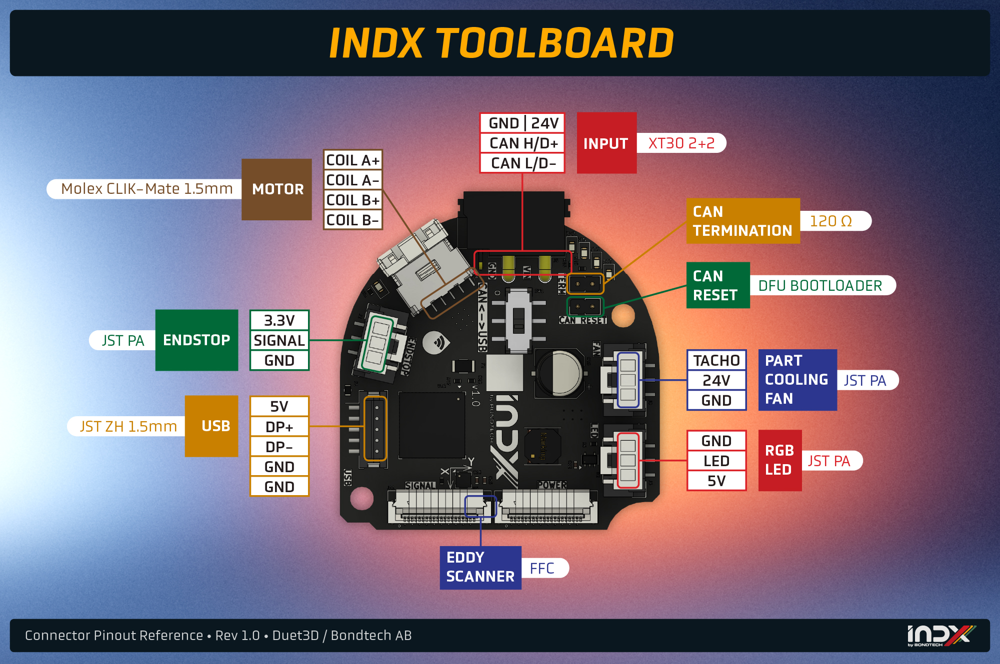
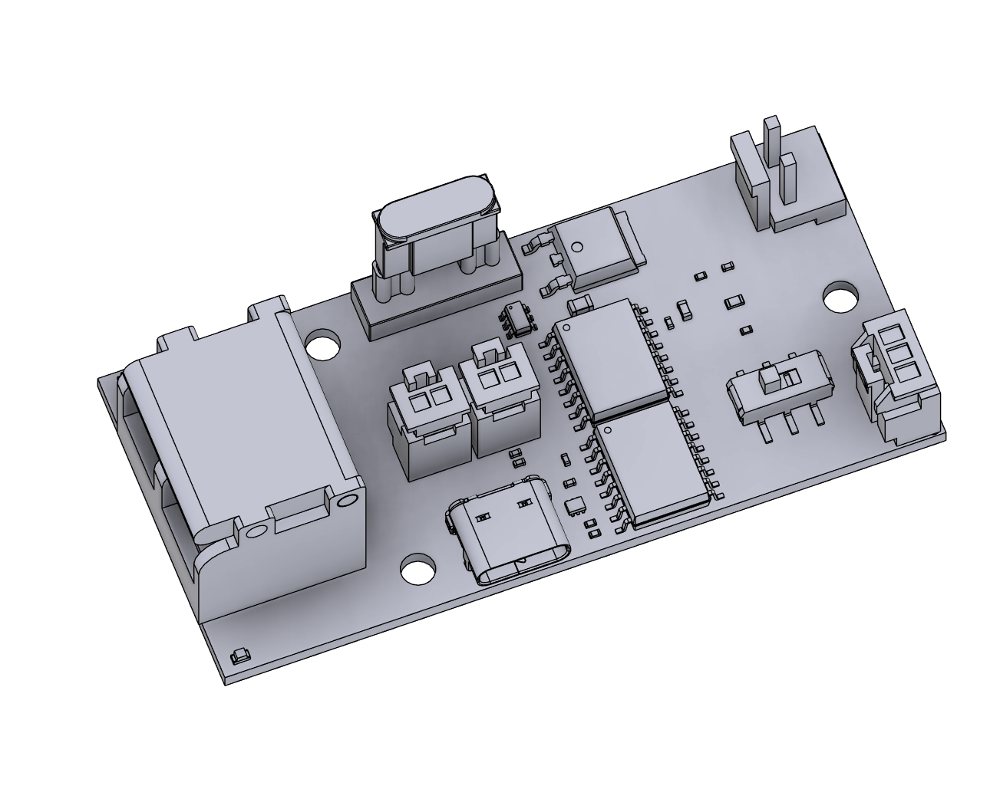

# INDX — Builders & Integrators Preview

> This document is intended for builders and integrators who want to start planning their INDX setup before the full documentation is available. It covers hardware, specifications, mechanical requirements, and design constraints.
>
> Full setup guides, firmware configuration, and calibration procedures will follow in the complete wiki.

---

## Table of Contents

1. [What is INDX?](#what-is-indx)
2. [How It Works](#how-it-works)
3. [Kits & What's in the Box](#kits--whats-in-the-box)
4. [Supported Printers](#supported-printers)
5. [Technical Specifications](#technical-specifications)
   - [Smart Head](#smart-head)
   - [Part Cooling](#part-cooling)
   - [Bondtech INDX PCB](#bondtech-indx-pcb)
   - [Link Board](#link-board)
   - [Thin Passive Tools](#thin-passive-tools)
6. [Requirements & Preparation](#requirements--preparation)
   - [Printer Requirements](#printer-requirements)
   - [Electrical Requirements](#electrical-requirements)
7. [Hardware Installation Overview](#hardware-installation-overview)
8. [Designing for INDX](#designing-for-indx)
   - [Dock Design](#dock-design)
   - [Part Cooling](#part-cooling-1)
   - [CAD Files & Templates](#cad-files--templates)
9. [Community & Contributing](#community--contributing)

---

## What is INDX?

INDX (INduction Dynamic eXtruder) is Bondtech's automatic tool-changer system for FDM 3D printers. It enables printing with multiple materials, colors, or nozzle sizes in a single print, with near-zero purge waste and tool changes in around 14 seconds. Run two tools or ten; scale your setup as far as your build space allows.

Unlike filament-switcher systems, INDX is a true tool changer: each tool carries its own filament directly. There is no shared filament path and no purge block required.

Unlike traditional mechanical tool changers, INDX uses wireless induction heating, so the passive tools contain **no wires, no heaters, no thermistors, and no electronics**. This makes each tool dramatically cheaper and mechanically simpler.

INDX is sold by Bondtech as a **Development Kit** for open CoreXY printers. Prusa Research has built an official first-party integration for the **CORE One** and **CORE One L**, sold directly through Prusa.

| | INDX Development Kit | Prusa CORE One / CORE One L |
|---|---|---|
| **Sold by** | Bondtech ([bondtech.se](https://www.bondtech.se)) | Prusa Research ([prusa3d.com](https://www.prusa3d.com)) |
| **For** | Most CoreXY printers with open firmware | Prusa CORE One / CORE One L |
| **Setup** | Self-managed (community-supported) | Plug-and-play |

This document focuses on the **INDX Development Kit** and community integrations.

---

## How It Works

INDX is built around two components: a single active **Smart Head** that stays on the gantry, and a set of interchangeable **Thin Passive Tools** parked in a dock.

### Smart Head

The single active unit that travels on the gantry. Contains all expensive and active components:

- **Induction coil**: wirelessly heats the nozzle of whichever passive tool is currently mounted
- **IR thermopile sensor**: reads nozzle temperature without physical contact
- **Dynamic eXtruder (DX)**: self-adjusting dual-drive extruder with automatic tension mechanism
- All wiring, electronics, and motion stays here; nothing transfers to the passive tools

### Thin Passive Tools

Interchangeable tools parked in a dock within reach of the gantry. Each tool contains a filament path and a specially designed nozzle, and nothing else. No wires, no heaters, no thermistors, no electronics. Heat is delivered wirelessly by the Smart Head's induction coil when the tool is picked up; the tool cools passively when deposited back in the dock.

Tools are held in the Smart Head by a high-precision **Maxwell coupling** (a 3-point kinematic coupling that self-aligns the tool to the exact same position every time it is picked up), ensuring micron-level repeatability on every tool change.

### Tool Change Sequence

1. Smart Head moves to the dock and deposits the current tool
2. Smart Head picks up the next tool
3. Induction coil heats the new nozzle to printing temperature (~4–10 seconds)
4. Printing resumes

**Total tool change time: ~14 seconds**, depending on temperature delta, priming, and travel distance.

---

## Kits & What's in the Box

### Development Kit

#### What's in the box

| Component | Description |
| --------- | ----------- |
| **Bondtech INDX Smart Head** | The active unit: induction coil, contactless IR temperature sensor, DX extruder, and all electronics. One per printer. Does not include a Thin Passive Tool; tools are ordered separately. |
| **Bondtech INDX Link Board** | USB/CAN bridge between your host computer and the Smart Head. Includes 330 mm AWG18 power cables with horseshoe connectors for PSU screw terminals. A USB cable from the Link Board to your host is not included; see [Link Board](#link-board) for requirements. |
| **Crimp & connector kit** | Crimps and connectors for terminating accessories to the Bondtech INDX PCB: part cooling fan, LED, endstop, and USB devices. |

#### Tools

| Option | Nozzle sizes | Best for |
| ------ | ------------ | -------- |
| **CHT (Core Heating Technology)** | 0.4 / 0.5 / 0.6 / 0.8 / 1.0mm | Most materials: PLA, PETG, ABS, ASA, PA, abrasive-filled filaments |
| **Standard (non-CHT)** | 0.25 / 0.4mm | Flexible filaments (TPU, TPE) and sensitive composites |

#### Accessories

| Accessory | Options | Notes |
| --------- | ------- | ----- |
| **Bondtech INDX Link Cable** | Choose length | XT30 2+2 cable carrying 24V, GND, CAN+/−, and shield from the Link Board to the Smart Head. Choose the length that fits your wiring run. See [USB cable requirements](#link-board) and the 2-meter total run limit. |
| **Tool Dock** | Pre-made SLS hardware or STL/STEP files | Bondtech sells ready-made docks for common 15×15 aluminium extrusion. Or download the files and print your own. |
| **X-Carriage adapter** | MGN12H option for 6mm belts, or download files | Required to mount the Smart Head to your carriage. Available for common CoreXY standards; check the shop or download from GitHub. |

> **Choosing cable length:** Measure the wiring run from your Link Board mounting location to the Smart Head along the actual path the cable will travel (over the gantry, not straight-line). Add some slack. When in doubt, order longer. A cable that is too short cannot be extended, and excess length can be coiled and managed. The combined length of your USB cable and Link Cable must not exceed 2 meters total.

---

## Supported Printers

### First-party integrations

| Printer | Status | Notes |
| ------- | ------ | ----- |
| Prusa CORE One | Available | Sold by Prusa Research. Plug-and-play. Supports up to 8 tools. |
| Prusa CORE One L | Coming later | First-party Prusa integration, availability timeline TBD. |

### Community integrations

| Printer | Status |
| ------- | ------ |
| Voron 2.4 | Community |
| Voron Trident | Community |
| RatRig V-Core | Community |
| Sovol | Community |
| Custom CoreXY | Any CoreXY with open firmware; see [Requirements](#requirements--preparation) |

Community configs and integration guides live on [github.com/BondtechAB/INDX](https://github.com/BondtechAB/INDX). If you get INDX running on an unlisted printer, that integration belongs there.

---

## Technical Specifications

*Specifications are preliminary and subject to change.*

### Smart Head

| Specification | Value |
| ------------- | ----- |
| Maximum operating voltage | 24V |
| Maximum nozzle temperature | 300°C |
| Maximum ambient operating temperature | 60°C |
| Flow rate | 40mm³/s *(measured at 220°C with 25°C ambient)* |
| Nozzle heat-up time | ~4–8 seconds |
| Tool change time | ~14 seconds |
| Power consumption | ~60W |
| Tool change mechanism | Maxwell coupling (3-point kinematic) |
| Heater type | Induction coil |
| Temperature sensor | Wireless & contactless IR thermopile |
| Nozzle sensor | Load cell (bi-directional) |
| Extrusion system | Direct Drive |
| Filament pre-tension | Self-adjusting (DX extruder, dual-drive with automatic tensioning) |
| Extruder chassis material | Aluminium |
| Cowling material | SLS-printed PA12 |
| Minimum tool center-to-center distance | 34mm bare; **41mm** with Bondtech part cooling solutions |
| Weight | 345g *(including one tool)* |

### Part Cooling

INDX uses a modular part cooling system. Cooling solutions snap onto the outside of the Smart Head cowlings without tools.

| Option | Description |
| ------ | ----------- |
| **Dual 40×10 fans** | Two axial fans mounted symmetrically for balanced airflow |
| **CPAP** | High-flow airflow from a remote CPAP blower unit routed via flexible tube, keeping weight off the gantry |

### Bondtech INDX PCB

**Electronics**

| Specification | Value |
| ------------- | ----- |
| Stepper driver | TMC2240 |
| Stepper run current | 0.6A |
| Extruder rotation distance | 5.7mm |
| Built-in accelerometer | LIS2DW |
| Built-in rotary encoder | AS5047D (magnetic) |

**Connectors**

| Connector | Pins | Notes |
| --------- | ---- | ----- |
| Motor | Coil A+, Coil A−, Coil B+, Coil B− | DX extruder stepper motor |
| Fan | TACHO, FAN+, GND | Supports tachometer feedback |
| LED | 5V (VBUS), NP OUT, GND | NeoPixel compatible |
| Endstop | 3V3, SIGNAL, GND | 3.3V logic level |
| USB | VBUS, DP+, DP−, GND, GND | Supports accessories such as camera or Beacon probe scanner |
| CAN termination jumper | — | Enable/disable CAN bus end-of-line termination |
| CAN Reset jumper | — | Puts the board into DFU mode for firmware flashing |
| Communication switch | CAN / USB | Must match the switch position on the Link Board |

**Klipper pin → port mapping**

| Function | Port(s) |
| -------- | ------- |
| Motor | STEP `PB12` · DIR `PB23` · ENN `PB4` · CS `PA10` · SPI1 SCLK `PA5` / MOSI `PA4` / MISO `PA7` |
| Endstop | `PA9` |
| Part cooling fan | FAN `PA1` · TACHO `PA0` |
| Heatsink fan | FAN0 `PA21` · TACHO `PA20` |
| Neopixel | `PA8` |
| Eddy scanner | ldc_int `PB10` · ldc_clk `PB11` · temp_ldc `PB9` |

**FFC cable warning**

The Smart Head contains two PCBs (INDX VF PCB and INDX MCU PCB) connected by 20-way FFC (Flexible Flat Cable) connectors. If you ever need to disconnect and reconnect them during servicing:

- Insert the cable straight; inserting at an angle is easy to do and will short pins. Powering up with a shorted FFC will likely damage the board.
- The latch direction on the INDX MCU PCB FFCs is counter-intuitive: the latch is **unlocked when up**. After inserting the cable, push the latch **down toward the PCB** to lock it.

### Link Board

The Link Board is a required component of every INDX Development Kit setup. It sits between your host computer and the Smart Head, acting as the USB/CAN bridge and providing protection features that make the connection stable and safe.

**Why the Link Board is required**

The Link Board caps USB communication speed to **12 Mbps (Full Speed)**. This is intentional: Full Speed USB is dramatically more stable in electrically noisy printer environments than High Speed (480 Mbps). In practice this means fewer dropouts and a much more reliable connection to the Smart Head.

**Protection features**

| Feature | What it does |
| ------- | ------------ |
| **USB isolator** | Electrically isolates the Smart Head from your host computer. Any electrical fault or noise on the printer side cannot travel back through the USB cable to your Raspberry Pi or PC. |
| **Reverse polarity protection** | Prevents damage if the 24V power input is connected with reversed polarity. |
| **4A fuse** | Protects the power input. If something goes wrong on the 24V side, the fuse blows before damage can propagate further. |

**Communication switch**

The Link Board has a switch to select between **USB** and **CAN** communication modes. This must match the switch position on the INDX MCU PCB — both boards must be set to the same mode or the connection will not work.

**USB cable (not included)**

A USB cable from the Link Board to your host computer is not included. Requirements:

- **Data cable, not a charge-only cable.** Charge-only cables omit the data lines entirely and will not work.
- **Correct impedance.** The cable must meet USB signal integrity requirements. Use a cable from a reputable brand.
- **Total USB run ≤ 2 meters.** The combined length of your USB cable (host to Link Board) and your INDX Link Cable (Link Board to Smart Head) must not exceed 2 meters. Plan your cable routing and Link Cable length selection with this in mind.

**Specifications**

| Specification | Value |
| ------------- | ----- |
| Host connection | USB-C |
| Printer-side connection | Link Cable to Bondtech INDX PCB |
| Input power | 24V + GND from PSU |
| Included power cables | AWG18, 330mm, horseshoe connectors for PSU screw terminals |
| USB speed | 12 Mbps (Full Speed) |
| Fuse rating | 4A |
| Max total USB run | 2 meters (USB cable + Link Cable combined) |

### Thin Passive Tools

All Thin Passive Tools are built from hardened steel, contain no electronics or wiring, and use induction heating via the Smart Head.

**CHT (Core Heating Technology): Standard choice for most materials**

| Specification | Value |
| ------------- | ----- |
| Available nozzle sizes | 0.4 / 0.5 / 0.6 / 0.8 / 1.0mm |
| Material | Hardened steel |
| Compatible filament diameter | 1.75mm |
| Maximum nozzle temperature | 300°C |
| Electronics | None |
| Weight | 25g |

**Standard (non-CHT): For flexible and sensitive materials**

| Specification | Value |
| ------------- | ----- |
| Available nozzle sizes | 0.25 / 0.4mm |
| Material | Hardened steel |
| Compatible filament diameter | 1.75mm |
| Maximum nozzle temperature | 300°C |
| Electronics | None |
| Weight | 25g |

---

## Requirements & Preparation

### Printer Requirements

- **Motion system:** CoreXY, H-bot, Markforged, Cartesian XY-head, or similar. Supported: any motion system where the toolhead moves in XY and Z is handled by the bed or gantry — i.e. CoreXY (not cross-gantry), H-bot, Markforged, and independent-axis Cartesian (XY-head, e.g. Ender 5). Not supported: bed-slinger Cartesian (XZ-head), where the bed moves in Y, or on Positron style machines.
- **Firmware:** Klipper, Kalico, or RepRap Firmware (RRF)
- **Gantry clearance:** 50mm X, 44mm Y. Total toolhead height is ~152mm including strain relief. Additional clearance is required for umbilical and filament management.
- **Dock mounting area:** Each dock is ~70mm tall, 28.5mm wide (X), and 25mm deep (Y). Minimum tool center-to-center spacing is 34mm bare, or 41mm when using the Bondtech part cooling solutions.
- **Wiring:** 24V from the PSU to the Link Board (included cables). Host computer to Link Board via USB-C. Link Board to Smart Head via INDX Link Cable (XT30 2+2, carries 24V, GND, CAN+/−, and shield).
- **Print volume impact:** With a well-designed integration the worst case is 28.5mm of Y travel lost. Avoid designs that exceed this.

### Electrical Requirements

**Bondtech INDX PCB**

The Bondtech INDX PCB is the central electronics board inside the Smart Head. It consists of two parts connected internally:

- **INDX VF PCB**: handles induction heating, contactless IR temperature sensing, and the heatsink fan
- **INDX MCU PCB**: handles processing and communication: extruder motor control, accelerometer, load cell, CAN-FD communication, and external connectors

All electronics are pre-installed inside the Smart Head; no internal wiring required.

**Link Board**

The Link Board is required and bridges your host computer to the Smart Head. For full details see [Link Board](#link-board) in Technical Specifications.

For wiring purposes:

- Requires **24V and GND** from your printer's PSU using the included cables
- Connects to the Smart Head via the INDX Link Cable
- Connects to your host computer via USB (cable not included — see [Link Board](#link-board))
- The communication switch on the Link Board must match the switch on the INDX MCU PCB

**Power**

- The system runs on **24V**
- The Link Board is powered by a direct 24V/GND connection from your PSU
- Power is passed through the Link Cable from the Link Board to the Smart Head; no additional PSU connection needed at the Smart Head

---

## Hardware Installation Overview

> Detailed step-by-step installation guides with firmware configuration will follow in the full documentation. This section gives builders enough to plan their integration.

### Smart Head mounting

The Smart Head replaces your printer's existing toolhead entirely. It mounts to the X-axis carriage using a two-part system:

1. **X-carriage adapter**: bolts onto your carriage
2. **Smart Head**: attaches to the adapter with 4 bolts

X-carriage adapters are available from Bondtech's shop (SLS Nylon 12 GF, common MGN12 options) or as STL/STEP files on [github.com/BondtechAB/INDX](https://github.com/BondtechAB/INDX) for less common setups.

### Dock mounting

The dock can be positioned anywhere within the gantry's travel range. Key constraints:

- Must be mounted to a **rigid frame element** — the dock hardware cannot be free-standing
- The Bondtech-sold dock hardware mounts on **15×15 aluminium extrusion**
- The dock must be positioned so a parked tool sits **2mm higher** than when held in the Smart Head — this is what allows clean pickup and deposit
- Each dock position is ~70mm tall, 28.5mm wide (X), 25mm deep (Y)
- Minimum tool center-to-center spacing: 34mm bare, 41mm with Bondtech part cooling

### Wiring

The Smart Head connects to the Link Board via a single INDX Link Cable (24V, GND, CAN+/−). Your host computer connects to the Link Board via USB. The Link Board receives 24V from the PSU via the included AWG18 cables. That covers the entire wiring run.

---

## Designing for INDX

### Dock Design

The dock holds passive tools in precise, repeatable positions so the Smart Head can pick them up reliably. There are strict geometry requirements; a dock that doesn't meet them will cause failed or inconsistent tool changes.

The reference dock design is available on [github.com/BondtechAB/INDX](https://github.com/BondtechAB/INDX). Use it as the starting point for any custom design.

**Key design constraints**

Each dock is approximately **70mm tall, 28.5mm wide (X), and 25mm deep (Y)**. Minimum tool center-to-center spacing is **34mm** bare, or **41mm** when using the Bondtech part cooling solutions. The design must achieve a pickup repeatability of **within 0.2mm**.

**Material recommendations**

Bondtech's sold docks use SLS-printed Nylon 12 GF. For self-printed docks, use a dimensionally stable material at elevated temperatures. ASA or ABS are common choices. Avoid PLA.

**Community designs**

Community dock designs for specific printers and frames will be collected on [github.com/BondtechAB/INDX](https://github.com/BondtechAB/INDX). If you design a dock for an unlisted setup, submit it via pull request.

### Part Cooling

INDX's modular part cooling system is designed to be extended by the community. The cooling solution snaps onto the outside of the Smart Head cowlings; the interface geometry is defined in the cowling CAD files on [github.com/BondtechAB/INDX](https://github.com/BondtechAB/INDX).

### CAD Files & Templates

All official CAD files are hosted on **Bondtech's GitHub**: [github.com/BondtechAB/INDX](https://github.com/BondtechAB/INDX)

**Reference geometry (STEP)**

| File | Format | Description |
| ---- | ------ | ----------- |
| [`INDX_simplified_1.17.step`](CAD/INDX_simplified_1.17.step) | STEP | Simplified reference model of the full INDX assembly; use as starting point for custom mounts, adapters, or cooling solutions |

**Printable parts (STL)**

| File | Part | Description |
| ---- | ---- | ----------- |
| [`INDX_MGN12H_X-carriage.stl`](CAD/STL/INDX_MGN12H_X-carriage.stl) | X-carriage adapter | Mounts the Smart Head to MGN12H linear rails (6mm belts) |
| [`INDX_Front_cover_left.stl`](CAD/STL/INDX_Front_cover_left.stl) | Smart Head cover | Front cover, left half |
| [`INDX_Front_cover_right.stl`](CAD/STL/INDX_Front_cover_right.stl) | Smart Head cover | Front cover, right half |
| [`INDX_PCB_Cover.stl`](CAD/STL/INDX_PCB_Cover.stl) | PCB cover | Protective cover for the Bondtech INDX PCB |
| [`INDX_4010_Duct_Left.stl`](CAD/STL/INDX_4010_Duct_Left.stl) | Part cooling (4010) | Dual 40×10 blower duct, left half |
| [`INDX_4010_Duct_Right.stl`](CAD/STL/INDX_4010_Duct_Right.stl) | Part cooling (4010) | Dual 40×10 blower duct, right half |
| [`INDX_CPAP_Duct_Left.stl`](CAD/STL/INDX_CPAP_Duct_Left.stl) | Part cooling (CPAP) | CPAP duct, left half |
| [`INDX_CPAP_Duct_Right.stl`](CAD/STL/INDX_CPAP_Duct_Right.stl) | Part cooling (CPAP) | CPAP duct, right half |
| [`INDX_CPAP_Duct_Top.stl`](CAD/STL/INDX_CPAP_Duct_Top.stl) | Part cooling (CPAP) | CPAP duct, top manifold |
| [`INDX_Beacon_Cartographer_Mount.stl`](CAD/STL/INDX_Beacon_Cartographer_Mount.stl) | Probe mount | Mount for a Beacon / Cartographer scanning probe |
| [`INDX_Dock_calibration_tool.stl`](CAD/STL/INDX_Dock_calibration_tool.stl) | Dock calibration tool | Printed jig for calibrating dock position during initial setup |

The repository is licensed under **GPL-3.0**.

---

## Community & Contributing

- **Chat & community help:** [Bondtech Discord](https://discord.gg/XDX9jDXN6e)
- **CAD files & community configs:** [github.com/BondtechAB/INDX](https://github.com/BondtechAB/INDX)

### Contributing a printer integration

If you've integrated INDX with a printer that isn't in the repo yet, or significantly improved an existing integration, submit a pull request. **What a good PR includes:**

- **Setup guide**: a complete written walkthrough — mounting, cabling, dock configuration, and initial calibration
- **Printer config**: a clean, working `printer.cfg` with INDX-specific sections clearly identified
- **Dock design**: source files (STEP or similar) and printable STLs. Printable files must be **designed to print without supports**
- **X-carriage adapter**: if you designed or adapted one, include it with the same requirements
- **Photos or video**: not required, but high-quality build photos or a walkthrough video make an integration significantly more approachable

**What Bondtech evaluates before merging:**

- **Print volume**: INDX always costs 28.5mm of Y-travel. The integration must not lose more than that
- **Tool count**: the design should support as many tools as the printer's build space allows
- **Closeness to stock**: fewer deviations from a standard build of that printer is better
- **User experience**: installation should be straightforward with rough edges designed out

**How to submit:**

1. Fork [github.com/BondtechAB/INDX](https://github.com/BondtechAB/INDX)
2. Add your files under the appropriate printer folder
3. Open a pull request with a short summary of what you're contributing and what printer it covers

Not sure if your integration is ready? Share it on Discord first.

---

*Full setup documentation, firmware guides, and calibration procedures will be available with the official release.*
