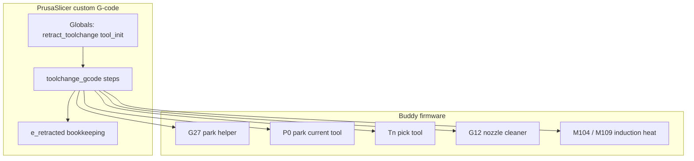
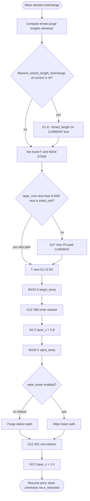
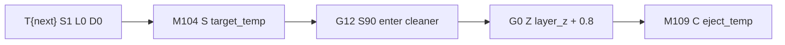
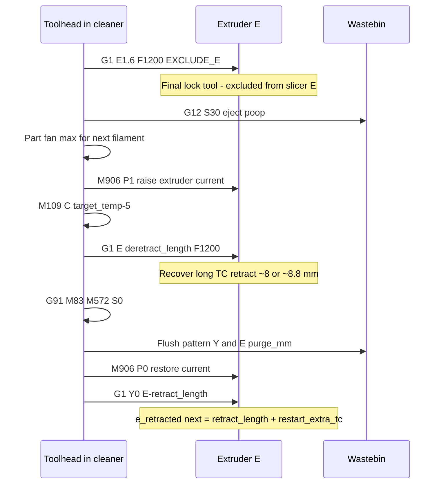
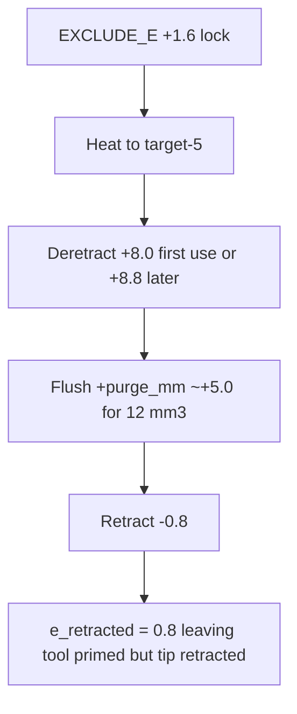
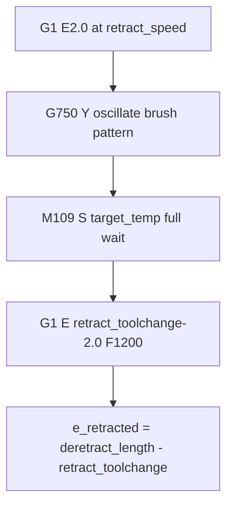
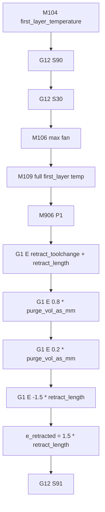
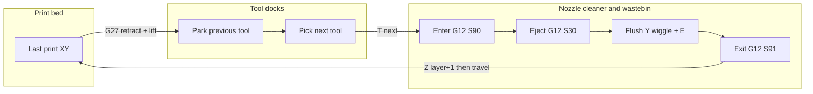

# Prusa CORE One INDX toolchange (port reference)

Step-by-step breakdown of how **Prusa CORE One / CORE One+ INDX** handles tool
changes, as emitted by the official PrusaSlicer profiles
(`Prusa CORE One INDX 4T/8T HF0.4`, default process `0.20mm Balanced`,
firmware era ~6.6.x).

This document describes **Prusa only**. It is a port reference for a future
implementation, not a comparison to other printers.

Source of truth for the sequences below: the machine `toolchange_gcode` and
`start_gcode` in those profiles (SimplyPrint / PrusaResearch dumps matching
PrusaSlicer 2.9.6-era INDX bundles).

---

## Hardware context (what the G-code assumes)

| Piece | Role in a toolchange |
|-------|----------------------|
| Smart Head | One DX extruder + induction coil. Locks onto a passive tool. |
| Passive tools | Filament path + nozzle only. No heater while docked. |
| Docks | Park positions for unused tools. |
| Nozzle cleaner + wastebin | Fixed station. Profile enters/exits it with `G12`. Default multi-tool path uses this instead of a wipe tower. |
| Dock fan (`M106 P6`) | Cools parked tools; speed set from filament type after layer 1. |

Default print profile: **`wipe_tower: 0`**. Mid-print toolchanges take the
**purge-station** branch. The wipe-tower branch exists in the same script for
when the tower is enabled.

---

## Who does what



The slicer script orchestrates order, temperatures, purge lengths, and E
accounting. Firmware owns dock geometry, latch lock/unlock inside `T`/`P0`,
and cleaner kinematics inside `G12`.

---

## Important globals (set in start G-code)

At print start the profile sets:

```
retract_toolchange = 8        ; mm of E used as the "long" TC retract/deretract budget
tool_init = (0,0,0,0,0,0,0,0) ; per-tool first-use flags
```

| Symbol | Typical value | Meaning in the TC script |
|--------|---------------|--------------------------|
| `retract_toolchange` | 8 mm | Long filament pull used around park / deretract / wipe-tower recover |
| `retract_length[n]` | 0.8 mm | Normal print retract (also used as short post-purge retract) |
| `travel_max_lift[n]` | 1.5 mm (machine) / filament may override to 0.8 | Z lift passed into `G27` |
| `filament_minimal_purge_on_wipe_tower[n]` | 12 mm³ (Prusament PLA) | Purge volume converted to filament length for the flush |
| `e_retracted[n]` | runtime | Slicer-side "how much this tool is still retracted" after the script |

`retract_length_toolchange` on the machine profile is **0**. The long TC retract
is **not** the slicer's built-in toolchange retract; it is this custom
`retract_toolchange` global plus firmware params on `G27`.

---

## Mid-print toolchange: overview

Two branches after the shared park/pick/heat/enter-cleaner prefix:



Default Balanced profile takes the **purge station** path.

---

## Phase A: prepare (slicer locals)

Before any motion, the script computes:

| Local | Formula (as written) | Role |
|-------|----------------------|------|
| `speed_tc` | `min(travel_speed, 350) * 60` | TC travel feedrate (mm/min) |
| `target_temp` | `temperature[next]` or first-layer temp if on first layer | Heat setpoint for the new tool |
| `eject_temp` | `max(160, target_temp - 60)` | Lower temp gate before cleaner work continues |
| `purge_mm` | `filament_minimal_purge_on_wipe_tower / filament_area` | Filament mm to flush (~5 mm for 12 mm³ @ 1.75 mm) |
| `purge_speed_fast` / `_slow` | Clamped from `filament_max_volumetric_speed` | Flush feedrates |
| `deretract_length` | First use of tool: `retract_toolchange` (8). Later: `retract_toolchange + retract_length` (or filament TC retract override) | How much to push before flush |

`tool_init[next]` tracks whether this tool has already been initialised this
print. First pickup uses a shorter deretract budget (8 mm only); later pickups
add the normal retract length so a previous post-purge retract is recovered.

---

## Phase B: leave the print - retract and park (current tool)

**Where:** still over the print (or wherever the slicer stopped), current tool
locked in the head.

```mermaid
sequenceDiagram
  participant Head as Toolhead
  participant E as Extruder E
  participant Dock as Dock of current tool
  Note over Head: At last print XY, Z near layer_z
  alt filament_retract_length_toolchange is nil
    Head->>E: G1 E-0.8 at retract_speed
    Note over E: Short retract only
  else filament override is set e.g. PLA 0.8
    Note over E: Skip short G1 retract
  end
  Head->>Head: G1 F speed_tc, M204 S7000
  Head->>E: G27 ... R8 V retract_speed Z lift slope
  Note over Head,E: Firmware park helper: lift + long retract ~8 mm
  Head->>Dock: P0 S1 L0 D0
  Note over Dock: Park current tool; S1 no XY settle move; L0/D0 no extra Z lift/return
```

### Commands in order

1. Optional `G1 E-[retract_length]` on the **current** tool if
   `filament_retract_length_toolchange[current]` is nil.
2. `G1 F{speed_tc}` then `M204 S7000` (TC accel).
3. Unless this is the weird "layer_num < 0 and next == initial_tool" skip case:
   - `G27 W3 Z{travel_max_lift[current]} P2 R{retract_toolchange} V{retract_speed[current]} A{travel_slope[current]}`
   - `P0 S1 L0 D0`

### E state after park

Expect the current tool's filament to be retracted by about **`retract_toolchange`
(8 mm)** via `G27`'s `R` parameter (plus the optional 0.8 mm if the nil-branch
ran). Machine `retract_length_toolchange` stays 0 so PrusaSlicer does not add a
second built-in TC retract on top.

### `G27` / `P0` / `T` parameter cheat sheet (Buddy)

Documented Buddy meanings for toolchanger-style commands (XL family docs; INDX
profiles use the same flag letters):

| Flag | On `T` / `P0` | Meaning |
|------|---------------|---------|
| `S1` | yes | Do not move tool in XY after the change |
| `L0` | yes | No Z lift from the T/P0 command itself |
| `L2` | start G-code pick for Z-home | Full lift (used when picking a tool for homing) |
| `D0` | yes | Do not return Z after a lift |

`G27` in this profile is **not** a bare Marlin park. The INDX script passes
wipe/retract-style parameters (`W`, `Z`, `P`, `R`, `V`, `A`). Treat it as
"firmware helper: lift + retract while preparing to park," then `P0` completes
the park. Exact `W3`/`P2` semantics are firmware-internal; the important
observable is **Z lift to `travel_max_lift` and E retract `R=retract_toolchange`**.

---

## Phase C: pick next tool and start heat

**Where:** head free of the previous tool; moves under firmware as part of `T`.



| Step | Command | Head location | E / heat |
|------|---------|---------------|----------|
| Pick | `T{next_extruder} S1 L0 D0` | Firmware travels to dock, locks next tool. Slicer asks for no extra XY settle / no T-owned Z hop. | Latch lock may advance E inside firmware (not visible as a separate slicer line here). |
| Heat request | `M104 S{target_temp}` | Still wherever `T` left the head (typically near docks / on the way to cleaner). | Target = print temp (or first-layer temp). Non-blocking set. |
| Enter cleaner | `G12 S90` | Moves into nozzle cleaner workspace. | - |
| Clearance | `G0 Z{layer_z + 0.8}` | Z above layer while in cleaner. | - |
| Temp gate | `M109 C{eject_temp}` | Wait in cleaner. | `eject_temp = max(160, target-60)`. Comment in profile: skip residency. Continues once this lower gate is met, not necessarily full `target_temp`. |

Heat is requested to **full print temperature**, but the script only **blocks**
on the lower `eject_temp` before purge-station mechanical steps. Full (or
near-full) temp is waited later with `M109 C{target_temp-5}` on the purge path,
or `M109 S{target_temp}` on the wipe-tower path.

---

## Phase D1: purge-station path (default, `wipe_tower == false`)

**Where:** nozzle cleaner / wastebin. Relative Y wiggles are cleaner-local.



### Step list

1. **`G1 E1.6 F1200`** wrapped in `EXCLUDE_E_START` / `EXCLUDE_E_END`  
   Profile comment: *Final lock tool*. Counts as mechanical latch finish, not
   print extrusion. Slicer E bookkeeping ignores this move.

2. **`G12 S30`** - *eject poop* (drop purged blob into wastebin / cleaner eject
   routine).

3. **`M106 S{max_fan_speed of next}`** - part cooling fan up for the flush.

4. **`M906 P1`** - raise extruder motor current for the purge push.

5. **`M109 C{target_temp - 5}`** - wait until nearly at print temperature.

6. **`G1 E{deretract_length} F1200`** - push filament to undo the long TC retract
   (and, on later uses of the tool, the extra retract length).

7. **Relative mode:** `G91`, `M83`, `M572 S0.0` (Pressure Advance off for flush).

8. **Flush** (`FLUSH_START` … `FLUSH_END`), total extrusion ≈ `purge_mm`:

   | Move | Approx share of `purge_mm` | Motion |
   |------|----------------------------|--------|
   | `G1 Y0 E{0.4*purge_mm}` | 40% | Slow push |
   | `G1 Y-1.3 E{0.3*purge_mm}` | 30% | Fast push while Y -1.3 |
   | `G1 Y0 E{0.05*purge_mm}` | 5% | Slow |
   | `G1 Y1.5 E{0.25*purge_mm}` | 25% | Fast push while Y +1.5 |

9. **`M906 P0`**, `M400`.

10. **Post-purge retract:** `G1 Y0 E-{retract_length[next]}` at retract speed.  
    Then set  
    `e_retracted[next] = retract_length[next] + retract_restart_extra_toolchange[next]`  
    so the slicer knows the tool is still retracted when printing resumes.

11. Restore travel feedrate `G1 F{speed_tc}`.

### E timeline (purge-station, typical PLA numbers)

Approximate filament mm on the **next** tool after pick (signs are G-code E
relative pushes/pulls; latch internals may add more inside firmware):



---

## Phase D2: wipe-tower path (`wipe_tower == true`)

Used when the process enables the wipe tower. Cleaner was already entered in
Phase C; this branch primes at the tower instead of the wastebin flush.



| Step | Command | Notes |
|------|---------|-------|
| Partial recover | `G1 E2.0` | Push 2 mm at retract speed |
| Brush | six `G750 Y… F21000 A` lines (Y 85→93→82→98.5→75→98.5) | Firmware brush/wipe helper while near tower/cleaner; exact `G750` semantics are Buddy-private |
| Full heat wait | `M109 S{target_temp}` | Blocks on full target (unlike purge path's `C` gates) |
| Finish deretract | `G1 E{retract_toolchange - 2.0}` | Remaining long recover (8 - 2 = 6 mm) |
| Bookkeeping | `e_retracted[next] = deretract_length - retract_toolchange` | Often 0 on first use (8-8), or ~0.8 on later use |

The slicer then builds and prints the wipe tower as usual; this custom block is
only the pre-tower recover / wipe assist after the tool pick.

---

## Phase E: leave cleaner and resume

Shared tail for both branches:

```gcode
G90
M83
G12 S91    ; Exit cleaning station
G0 Z{layer_z + 1.0}
G4 S0
```

**Where:** exit cleaner, Z at `layer_z + 1.0`, absolute XYZ, relative E. Print
motion resumes. The next extrusion unretracts according to `e_retracted[next]`
and normal slicer logic.

---

## `G12` cleaner modes (as labelled in the profile)

| Command | Profile comment | When |
|---------|-----------------|------|
| `G12 S90` | enter cleaner | After pick, before purge or tower assist |
| `G12 S30` | eject poop | Purge-station path after lock; also start-of-print prime |
| `G12 S91` | Exit cleaning station | End of every TC custom block |

Treat `S` as a cleaner *routine index*, not a spindle speed. Coordinates for
the station come from nozzle-cleaner calibration in firmware.

---

## Start-of-print priming (related, not a mid-print TC)

Multi-tool prints with **wipe tower off** skip this block
(`used_tools == 1 or (used_tools > 1 and wipe_tower)`). So the default
Balanced multi-tool INDX profile does **not** run the start cleaner prime;
the first mid-print (or first tower) path handles priming instead.

When the block **does** run (single tool, or multi-tool with wipe tower on):



Also at start, before MBL:

- Pick a tool for Z home with `T… S1 L2 D0` (full lift).
- Per used non-FLEX tool: `M574 S{tool} V35 T{temp} F{feed}` (filament/tool
  prep; public docs are thin - observe as required before `G427`).
- `G427 R2 P3` - profile comment: calibrate all used and mapped tools.
- `T{initial_tool} S1 L0 D0` for the print tool.

End G-code parks with `P0 S1` and moves to a fixed park XY `(242, 205)`.

---

## Spatial sketch (purge-station TC)

Not to scale. Shows **logical** stations the script visits.



---

## Retract ownership summary (Prusa)

| Moment | Who retracts / pushes | Amount (typical PLA) |
|--------|----------------------|----------------------|
| Before park | Optional slicer `G1 E-` if filament TC retract nil | 0.8 mm or skipped |
| During park helper | `G27 … R{retract_toolchange}` | 8 mm |
| Built-in slicer TC retract | Machine setting | **0** (disabled) |
| After pick, before flush | `G1 E1.6` lock | 1.6 mm, E-excluded |
| Before flush | `G1 E{deretract_length}` | 8 or 8.8 mm |
| Flush | Relative E pulses | ~`purge_mm` (~5 mm for 12 mm³) |
| After flush | `G1 E-{retract_length}` | 0.8 mm |
| Resume print | Slicer unretract using `e_retracted` | 0.8 mm (+ restart extra if set) |

---

## Temperature ownership summary (Prusa)

| Moment | Command | Setpoint |
|--------|---------|----------|
| After pick | `M104 S{target_temp}` | Full print (or first-layer) temp |
| Before purge mechanics | `M109 C{eject_temp}` | `max(160, target-60)` |
| Before deretract+flush | `M109 C{target_temp-5}` | Near full |
| Wipe-tower branch | `M109 S{target_temp}` | Full, with residency-style wait |
| Docked tools | none | No standby heat (passive tools) |

---

## Implementation notes for a future port

These are observations about Prusa's design, not instructions for another
machine:

1. **Long TC retract is script+firmware (`retract_toolchange` + `G27`), not**
   `retract_length_toolchange`.** That machine field is zero.
2. **Default purge is off-bed** (cleaner + wastebin). Wipe tower is optional.
3. **Latch lock extrusion is explicit and E-excluded** (`E1.6` + `EXCLUDE_E`).
4. **Heat is staged:** request full temp early, only wait for a lower gate
   before cleaner work, then wait near-full before flushing.
5. **PA is forced off** for the flush (`M572 S0`), then left for the rest of
   the print to restore via normal filament G-code / later commands.
6. **Extruder current is boosted** for purge (`M906 P1` / `P0`).
7. **`e_retracted` hand-off** tells the slicer the tip is still retracted after
   the custom block so the first print segment unretracts cleanly.
8. **`T`/`P0` flags** keep Z/XY policy in the custom script (`S1 L0 D0`) rather
   than letting the toolchange command add its own hop/settle.

### Klipper port (INDX)

The Klipper purge-station port lives in
[`macros/indx-tc-purge.cfg`](../../macros/indx-tc-purge.cfg) (`INDX_TC_POST`,
`INDX_TC_RETRACT`, `INDX_TC_PURGE_TEST`). Call site and include notes:
[`README.md`](README.md). That module is a greenfield successor for post-TC
purge/prime; it is not based on the experimental pellet / LC prime path.

---

## Appendix: annotated mid-print toolchange skeleton

Compressed from the official profile (purge-station default). Placeholders
match PrusaSlicer custom G-code variables.

```gcode
; --- prepare locals: speed_tc, target_temp, eject_temp, purge_mm, deretract_length ---

; optional short retract on CURRENT if filament_retract_length_toolchange is nil
G1 E-{retract_length[current]} F{retract_speed[current]*60}

G1 F{speed_tc}
M204 S7000

; park CURRENT (skipped only in special initial-tool prelude case)
G27 W3 Z{travel_max_lift[current]} P2 R{retract_toolchange} V{retract_speed[current]} A{travel_slope[current]}
P0 S1 L0 D0

; pick NEXT
T{next_extruder} S1 L0 D0
M104 S{target_temp}

G12 S90                          ; enter cleaner
G0 Z{layer_z + 0.8}
M109 C{eject_temp}               ; wait lower gate

; === purge station ===
; EXCLUDE_E
G1 E1.6 F1200                    ; final lock
; END EXCLUDE_E
G12 S30                          ; eject poop
M106 S{fan max next}
M906 P1
M109 C{target_temp-5}
G1 E{deretract_length} F1200
G91
M83
M572 S0.0
; flush ~purge_mm with Y wiggle
M906 P0
M400
G1 Y0 E-{retract_length[next]} F{retract_speed[next]*60}
; e_retracted[next] = retract_length[next] + retract_restart_extra_toolchange[next]

G90
M83
G12 S91                          ; exit cleaner
G0 Z{layer_z + 1.0}
G4 S0
```

---

## Sources

- PrusaResearch machine profile: `Prusa CORE One INDX 4T HF0.4 nozzle` /
  `8T` (toolchange, start, end G-code).
- Print profile: `0.20mm Balanced @COREONEINDX HF0.4` (`wipe_tower: 0`).
- Filament example: `Prusament PLA @COREONEINDX HF0.4`
  (`filament_minimal_purge_on_wipe_tower: 12`,
  `filament_retract_length_toolchange: 0.8`, `idle_temperature: nil`).
- Buddy public docs for `T` / `P0` / `G27` flag letters:
  [Buddy firmware-specific G-code commands](https://help.prusa3d.com/article/buddy-firmware-specific-g-code-commands_633112).
- Firmware product notes for cleaner + wastebin behaviour: Prusa CORE One INDX
  firmware 6.6.x release material.
