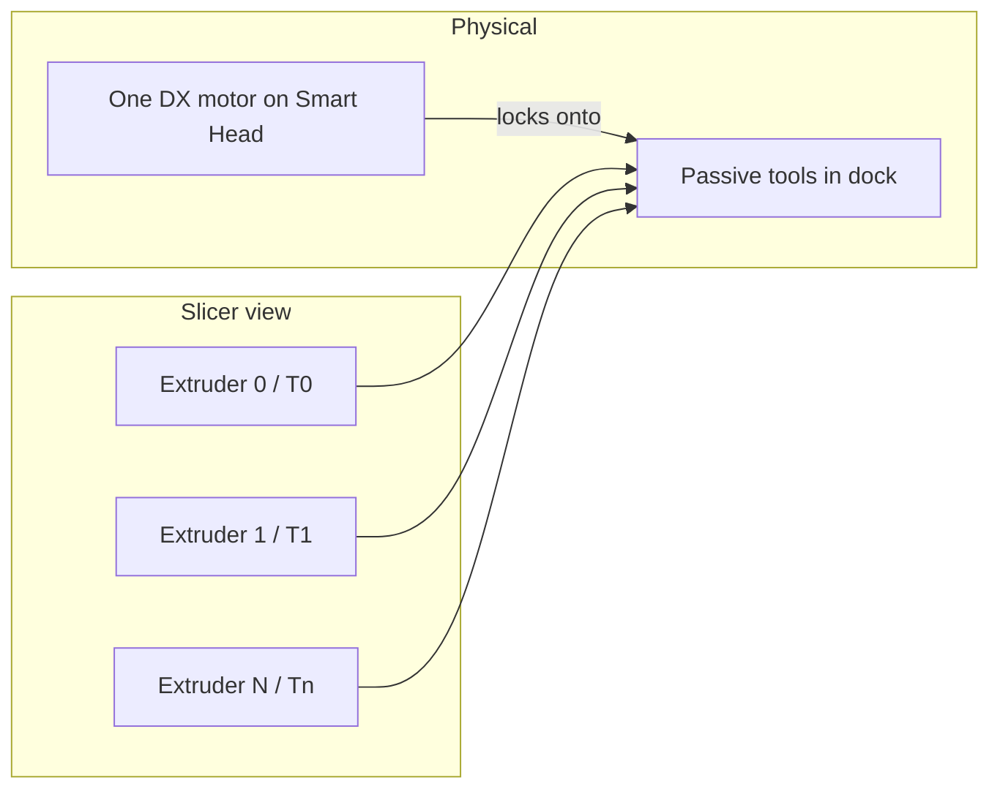
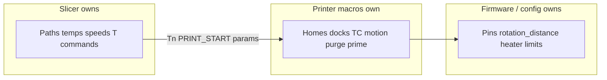

# VZBOT_INDX OrcaSlicer profiles

Printer and process presets for a VZBOT running Bondtech INDX under Klipper.
Built from the local **VZBOT** machine preset and **INDX** process preset, plus
settings that transfer from Prusa CORE One INDX (4T HF0.4 / 0.20mm Balanced in
PrusaSlicer 2.9.6).

Files in this folder:

| File | Role |
|------|------|
| `VZBOT_INDX.machine.json` | Printer / machine preset |
| `VZBOT_INDX.process.json` | Process / print preset |
| [`PRUSA_CORE_ONE_INDX_PORT.md`](PRUSA_CORE_ONE_INDX_PORT.md) | Prusa CORE One INDX toolchange sequence (port reference) |

## Install

1. Restart OrcaSlicer (or reload presets) if the profiles were copied into your
   user folder, **or** File → Import → Import configs and pick the JSON files
   here.
2. Select printer **VZBOT_INDX** and process **VZBOT_INDX**.

Keep VZBOT kinematics, bed size, and host from the parent machine profile. Do
not paste CORE One wall/travel speed limits onto the VZBOT.

## Mental model

The Smart Head has **one** extruder motor. Each docked tool carries its own
filament and nozzle. When the head locks a tool, that motor drives that tool's
filament.

The slicer does not model "one motor". It models **one virtual extruder per
tool** (`T0`, `T1`, …) so each tool can have its own filament type, colour,
temperature, and flow. Tool changes in G-code are `T{n}` commands that INDX
macros turn into park / pickup / heat sequences.



## Why Single Extruder Multimaterial stays off

Orca's **Single Extruder Multimaterial** checkbox
(`single_extruder_multi_material`) does **not** mean "this printer has one
extruder motor". It means filament-switcher mode: MMU, AMS, and similar systems
with **one nozzle and a shared filament path**.

| Concept | Meaning |
|---------|---------|
| Physical drive | One DX motor on the head; engages whichever tool is locked |
| Slicer extruders | One virtual extruder per tool (`T0`…`Tn`) |
| SEMM / `single_extruder_multi_material` | Filament-switcher mode: unload/load, ramming, shared-path G-code |

With SEMM **on**, the slicer emits the wrong class of G-code (filament change,
ramming, cooling-tube style moves) and often will not output clean `T0` /
`T1`… toolchanger commands. With SEMM **off** and N extruders configured, it
emits multi-tool G-code that INDX understands.

Bondtech's main README says the same for PrusaSlicer / SuperSlicer: leave
**Single Extruder Multimaterial Printer** unchecked. That mode is for filament
switchers and generates the wrong G-code for a tool changer.

One motor ≠ SEMM. Configure INDX as a multi-extruder toolchanger with SEMM
unchecked.

Do not set standby / idle temperatures per tool in the slicer. Docked tools
have no heater; preheat is impossible until the Smart Head picks them up.
If the slicer still emits `M104 S… T1` (etc.), include `m104.cfg` on the
printer so those commands apply to the single `[extruder]` and do not raise
"Extruder not configured".

## Machine settings

Values below match `VZBOT_INDX.machine.json`. Reasoning is why they differ from
a single-tool VZBOT or from a blind copy of Prusa CORE One.

| Setting | Value | Why |
|---------|-------|-----|
| `single_extruder_multi_material` | `0` | Toolchanger, not MMU/AMS. See section above. |
| `enable_filament_ramming` | `0` | No shared filament path; ramming is for switchers. |
| `retraction_length` | `0.8` mm | Prusa CORE One INDX default; short direct-drive retract. |
| `retraction_speed` | `40` mm/s | Same source profile. |
| `deretraction_speed` | `30` mm/s | Same source profile. |
| `retract_length_toolchange` | `0` | Avoid double-retract. Park, latch lock/unlock, and macros own filament motion around a toolchange. |
| `retract_restart_extra_toolchange` | `0` | Same reason. |
| `retract_when_changing_layer` | `1` | Match Prusa layer-change retract behaviour. |
| `z_hop` | `0.2` mm | Prusa `retract_lift`; enough clearance without tall hops on every travel. |
| `wipe` | `0` | No travel wipe fighting printer-side purge/brush. |
| `retract_before_wipe` | `80%` | Harmless with wipe off; matches Prusa if wipe is turned on later. |
| `purge_in_prime_tower` | `0` | Purge belongs on the printer (`INDX_TC_POST` purge station), not in a slicer flush into the tower. |
| Bed / speeds / host | From VZBOT | Keep your machine limits; Prusa CORE One numbers are a different printer. |

### Tool change G-code

Slicer owns tool select only. Staged heat, purge-station flush, brush wipe,
and tip bookkeeping live in `INDX_TC_POST` (see
[`macros/indx-tc-purge.cfg`](../../macros/indx-tc-purge.cfg)). That module is
the post-TC purge/prime path; it supersedes the experimental pellet / LC prime
macros and does not call them.

```gcode
; VZBOT_INDX tool change - T then post-TC purge station
T{next_extruder} TEMP={temperature[next_extruder]}
M400
INDX_TC_POST TEMP={temperature[next_extruder]}
```

Leave `unretract_after_exit=0` so travel from the station is dry. After the
slicer reaches the first print XY, unretract there (same amount as
`post_purge_retract`, default 0.8 mm):

```gcode
INDX_TC_UNRETRACT
```

Or set Orca **Extra length on restart after toolchange** to `0.8`. Do **not**
put `INDX_TC_UNRETRACT` at the end of change-tool G-code - that runs before
travel back to the part.

Include on the printer (after dock TC macros):

```ini
[include indx-tc-purge.cfg]
```

Station / brush / limit calibration (jog order, envelope maths, staged
tests): [`macros/INDX_TC_PURGE_SETUP.md`](../../macros/INDX_TC_PURGE_SETUP.md).

`T{next_extruder}` runs the INDX `Tn` / `CHANGE_TOOL` path. `M400` waits for
dock motion before purge-station work. Do **not** also wait for full heat in
the slicer - `INDX_TC_POST` stages heat (eject gate, then near-full before
flush).

Hardware check from the console: `INDX_TC_PURGE_TEST TEMP=220`.

Per print, call `INDX_TC_RESET` once at start (the example `PRINT_START`
does this). The first `INDX_TC_POST` for each tool purges
`first_use_purge_mm` (default **25 mm** filament); later swaps on that
tool use `purge_volume_mm3` (default 12 mm³).

### Start and end G-code

Start:

```gcode
SET_PRINT_STATS_INFO TOTAL_LAYER=[total_layer_count]
[notes]

PRINT_START BED_TEMP=[bed_temperature_initial_layer_single] EXTRUDER_TEMP={first_layer_temperature[initial_tool]} TOOL=[initial_tool]
```

End:

```gcode
PRINT_END
; total layers count = [total_layer_count]
```

## Process settings

Values below match `VZBOT_INDX.process.json`. Speeds and accelerations mostly
come from the older **INDX** process on this machine; layer height, infill, and
prime-tower defaults follow Prusa's 0.20 Balanced **intent**, not CORE One
speed caps.

| Setting | Value | Why |
|---------|-------|-----|
| `layer_height` | `0.2` | Prusa 0.20mm Balanced default. |
| `initial_layer_print_height` | `0.2` | Keep first layer aligned with that baseline. |
| `sparse_infill_density` | `15%` | Same Balanced profile. |
| `sparse_infill_pattern` | `grid` | Same. |
| `enable_prime_tower` | `0` | Prusa CORE One INDX defaults wipe/prime tower **off** and uses a brush/purge station. This stack uses printer-side purge instead. |
| `prime_tower_width` | `20` | Kept small if you enable the tower later. |
| `prime_volume` | `12` | Roughly Prusa `filament_minimal_purge_on_wipe_tower` (12 mm³) if the tower is turned on. |
| `wipe_tower_bridging` | `10` | Match Prusa when tower is used. |

Bondtech still recommends a wipe tower for stringy materials. Prefer enabling a
**small** tower in the process when needed, rather than copying MMU-sized purge
volumes. Do not enable the tower **and** a full macro purge without knowing
which one is actually required.

## What not to copy from Prusa

Prusa CORE One INDX start and toolchange G-code calls Buddy firmware features:
`G12` cleaner, `G27`, `P0` park, `G427` tool mapping, `M574`, and similar. That
will not run on Klipper.

Transfer retract lengths, SEMM off, tower-off defaults, and the idea that the
slicer selects the tool. Leave dock motion, staged heat, purge-station flush,
brush wipe, and latch lock/unlock to your macros (`CHANGE_TOOL` +
`INDX_TC_POST`).

## Multi-source ownership

Several places can set temperature, retract, or extrude around a toolchange.
Pick one owner per concern; overlap is what causes weird first lines after a
swap.



| Concern | Owner | Everyone else |
|---------|-------|---------------|
| Tool pick / park motion | INDX macros | Slicer only emits `T{n}` |
| Heat after pickup | `INDX_TC_POST` (staged) | Slicer only passes `TEMP=`; no duplicate full heat wait |
| Purge / brush / tip | `INDX_TC_POST` / `indx-tc-purge.cfg` | Keep prime tower off unless you choose tower-only; do not also run old pellet / LC prime |
| Print temps / speeds / flow / PA | Slicer filament + process | Avoid mid-print macro overrides |
| `rotation_distance`, heater, fans | `printer.cfg` | Do not retune INDX extrusion via `rotation_distance` (Bondtech: use slicer flow) |
| Dock geometry / offsets | `indx.cfg` + calibration | Not the slicer |

Practical rule: if two places can extrude or retract on a toolchange, remove
one.

When something looks wrong after a swap, check in this order: slice preview →
raw G-code around `T` → console log of macros → only then tweak process
numbers.

## PRINT_START parameter contract

This profile's start G-code matches the example in
[`macros/print_start.cfg`](../../macros/print_start.cfg):

| Parameter | Meaning |
|-----------|---------|
| `BED_TEMP` | First-layer bed temperature |
| `EXTRUDER_TEMP` | First-layer temperature of the **initial** tool |
| `TOOL` | Initial tool index (`initial_tool`) |

If the live printer still expects Voron-style `BED=` / `EXTRUDER=` with no
`TOOL=`, either update `PRINT_START` to the example macro or edit the machine
start G-code back to the old names. Mismatched parameter names fail at the
first line of the print.
